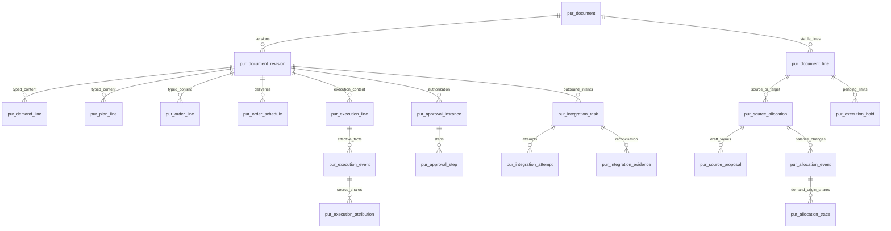

# 采购执行中心核心业务数据库设计

版本：核心版 V1.1 评审稿  
日期：2026-09-24  
数据库：人大金仓 KingbaseES V8，Oracle 兼容模式（用户已确认）；具体 R 版本、补丁和驱动待实施核验  
配套文件：[核心业务 UI 系统设计方案](PROCUREMENT_CORE_UI_DESIGN.md) · [建表 SQL](../database/kingbase/001_pur_core_schema.sql) · [建库说明](../database/kingbase/README.md)

本次修订：移出供应商确认专用模型；保留订单交付及可选运行备注；所有表统一 pur_ 前缀；不设置任何物理外键或级联删除。

## 1 设计边界与结论

数据库承载需求、可选计划、订单版本、来源分配、订单交付、履约正反事实、审批、异常及 SAP 任务。合同、寻源、预算、库存、发票、付款、质保等外围业务本期不建业务表，仅按核心操作需要保留外部引用或安全校验证据。

核心设计结论：采用关系型业务表；单据和行具有稳定身份；每次提交冻结版本；分配采用独立台账；履约采用不可覆盖的正反事件；集成任务在业务事务内登记、事务外发送。数据库约束负责主键、唯一性及可表达的行内校验；所有表间引用完整性、归属、跨行额度、状态机、权限和外部依赖均由服务端事务校验，不设置物理外键。

本文件交付逻辑模型、字段字典、键与索引、事务规则、查询口径和实施检查。数据库基线已确认是 KingbaseES V8、Oracle 兼容模式；另附新建空 schema 使用的建表 SQL；该 SQL 未在用户实例执行验证，未获取连接信息，也未连接或修改任何数据库。

### 1.1 人大金仓适配原则

- 不使用 MySQL 的反引号、AUTO_INCREMENT、UNSIGNED、InnoDB、ON DUPLICATE KEY 等作为设计基线。
- 金额和数量采用精确十进制 NUMBER(p,s)；应用端采用十进制计算。接口中的 ID 和 decimal 使用字符串，防止 JavaScript 大整数和浮点精度损失。
- 主键采用 NUMBER(19,0)，由统一 ID 服务或金仓序列分配；服务端按有符号 64 位整数使用时，增加范围约束 `1 <= id <= 9223372036854775807`。序列允许有间断，不用 `MAX(id)+1`，不把技术主键当连续业务单号。
- 时间使用 TIMESTAMP(6)，统一存 UTC，连接会话和应用显式约定时区，展示按用户时区。业务日期使用 DATE，写入前归一到业务日零时；Oracle 兼容模式下不可假设 DATE 自动去掉时分秒。
- 布尔采用 NUMBER(1,0) + CHECK(0,1)。枚举使用 VARCHAR2 + CHECK/服务枚举校验，不用数据库裸数字业务状态。中文名称显式使用 VARCHAR2(n CHAR)，不依赖会话的默认长度语义。
- 结构化快照和配置以 JSON_DOC 表示逻辑类型，物理基线为 CLOB，并由应用严格校验 JSON、限制长度和结构。JSON/JSONB 只有在目标补丁、驱动和索引能力核验后才作为可选优化；核心数量、金额、状态、关系始终使用关系字段，不藏在 JSON 中。
- 表/列名统一 snake_case，不使用需要双引号保护的大小写混排或保留字。数据库字符集采用经 DBA 确认的 UTF8；字符串排序及编码大小写规则明确配置。
- 空字符串按字段语义规范成 NULL 或拒绝，按 Oracle 兼容的空串处理风险设计，不能用空串作为唯一键的哨兵值。唯一业务键的组成列原则上 NOT NULL。
- 本期采用单部署多组织，不声称已经具备 SaaS 租户隔离；未来 SaaS 需整体引入租户域，而不是只给几张表补 tenant_id。

上述物理类型是在已确认模式上的设计选择，参考金仓 V8 官方类型和迁移文档。V8 内部 R 版本仍有兼容参数差异，因此“Oracle 兼容”不等于可直接执行任意 Oracle 脚本；也不要求修改用户实例的兼容模式或重新初始化数据库。[V8 数据类型](https://help.kingbase.com.cn/v8/development/sql-plsql/sql/datatype.html) · [V8 类型迁移说明](https://help.kingbase.com.cn/v8/development/develop-transfer/transplant-r3/transplant-r3-2.html) · [V8 R 版本兼容差异](https://help.kingbase.com.cn/v8/development/develop-transfer/transplant-r3/transplant-r3-1.html)

## 2 字段约定

本字典中的类型缩写用于减少重复，不是数据库自定义类型。

| 缩写 | 建议物理类型 | 说明 |
| --- | --- | --- |
| ID | NUMBER(19,0) | 正数主键/逻辑关联ID；按第 1.1 节限制范围，API 序列化为字符串 |
| CODE | VARCHAR2(64 CHAR) | 状态、业务代码、外部编码；外部长度超过时显式扩容 |
| NO | VARCHAR2(80 CHAR) | 业务单号、外部单号，不以数字存储前导零编号 |
| NAME | VARCHAR2(200 CHAR) | 名称/标题快照 |
| NOTE | VARCHAR2(2000 CHAR) | 原因/说明；核验目标版本字节上限，更长内容使用 LOB |
| QTY | NUMBER(20,6) | 数量；按单位精度进一步校验 |
| MONEY | NUMBER(20,6) | 金额；展示/业务舍入按币种小数位，不依靠入库隐式舍入 |
| PRICE | NUMBER(24,10) | 单价、计价基数和换算计算输入 |
| RATE | NUMBER(18,10) | 税率、容差率和分摊比例，比例采用 0～1 |
| FLAG | NUMBER(1,0) | CHECK 值只能为 0/1 |
| TS | TIMESTAMP(6) | UTC 时间；业务日单独 DATE |
| DOC | CLOB | 逻辑 JSON_DOC；应用校验结构，不以 CLOB 内容参与唯一键 |
| LOB | CLOB | 非结构化长文或脱敏报文，不设置普通全文列 B-tree 索引 |

下文字典为便于阅读，局部保留逻辑写法 `VARCHAR(n)`、`INTEGER`、`BIGINT`：生成本项目物理脚本时分别统一映射为 `VARCHAR2(n CHAR)`、`NUMBER(10,0)`、`NUMBER(19,0)`，不表示切换到 PostgreSQL 模式。计数和 row_version 非负，精度上限由应用校验；主键与逻辑关联ID使用完全一致的物理类型。

字段标记：`!` 为数据库 NOT NULL；`?` 为允许 NULL。业务草稿允许缺值，所以许多商业字段数据库可空，但提交时必须按场景校验。不能为了草稿保存填入虚假供应商、0 价格或占位日期。

可编辑实体统一增加 `created_at TS!`、`created_by ID!`、`updated_at TS!`、`updated_by ID!`、`row_version BIGINT!`。追加型事件只增加 `created_at/created_by`，不允许更新/删除正式业务内容。系统任务使用明确的系统主体 ID，不留无法归属的操作者。

软删除仅用于未提交草稿及参考目录停用；正式单据以 CANCELLED/CLOSED 或反向记录处理。不设置 FOREIGN KEY / REFERENCES 或级联删除。下文的关联、复合关联和引用均是逻辑关系，不会生成外键 DDL；主键、唯一约束、NOT NULL、CHECK 和普通索引仍保留。后端在同一事务中检查被引用对象存在、类型、法人、版本、行归属及删除依赖，所有入口包括导入和后台任务遵守同一协议。核心字段附中文 COMMENT。

## 3 表清单和关系总览

下列 45 张表包含可复用的组织、权限、附件和任务支撑表，不代表新增 45 个页面。企业已有统一 IAM、组织或附件平台时按适配契约复用，不再建设另一套主数据权威。

| 组 | 表 |
| --- | --- |
| 基础目录与授权 7 | pur_org、pur_user、pur_role、pur_role_permission、pur_user_role_scope、pur_reference、pur_unit_conversion |
| 单据身份与版本 3 | pur_document、pur_document_revision、pur_document_line |
| 需求与计划 4 | pur_demand_header、pur_demand_line、pur_plan_header、pur_plan_line |
| 订单 4 | pur_order_header、pur_order_line、pur_order_schedule、pur_order_distribution |
| 外部依据与展示关系 2 | pur_external_reference、pur_document_relation |
| 来源分配 4 | pur_source_allocation、pur_source_proposal、pur_allocation_event、pur_allocation_trace |
| 履约事实 5 | pur_execution_header、pur_execution_line、pur_execution_event、pur_execution_hold、pur_execution_attribution |
| 异常审批待办 4 | pur_exception_case、pur_approval_instance、pur_approval_step、pur_task |
| 附件审计 3 | pur_attachment、pur_attachment_link、pur_audit_event |
| 规则 2 | pur_rule_version、pur_rule_bundle |
| 集成可靠性 6 | pur_integration_task、pur_integration_attempt、pur_integration_evidence、pur_external_document_link、pur_inbox_message、pur_command_dedup |
| SAP只读上下文 1 | pur_sap_line_context |



图表达逻辑关系，不代表物理外键，也不表示某个版本可以同时属于需求、计划、订单三种业务。业务类型判别及复合归属校验见第 4 节。外围合同只有 `pur_external_reference`，本期没有本地合同主表、合同额度账或结算表。

## 4 单据版本和引用完整性

### 4.1 三个轻量公共身份表

公共表只承载身份、版本和审计指针。业务字段放类型化明细表，不建“任意字段名＋字段值”的 EAV 大表。

**pur_document 单据稳定身份**

| 字段 | 类型 | 规则 |
| --- | --- | --- |
| id | ID! PK | 内部稳定单据 ID |
| document_type | CODE! | DEMAND / PLAN / ORDER / EXECUTION |
| document_no | NO! | UK；生成一次后不随版本改变 |
| company_id | ID! 逻辑关联 pur_org | 法人；全部子对象同法人 |
| owner_id | ID! 逻辑关联 pur_user | 当前业务负责人 |
| lifecycle_status | CODE! | DRAFT / ACTIVE / CLOSED / CANCELLED |
| effective_revision_id | ID? | 指向本单当前正式版本 |
| working_revision_id | ID? | 指向本单唯一工作/在途版本 |
| hold_reason | NOTE? | 整单冻结时的业务说明 |

`effective_revision_id/working_revision_id` 使用 `(id, revision_id)` 对 `pur_document_revision(document_id,id)` 的复合引用，避免指到别的单据。创建时先建无指针根记录，再建版本并回填；在同一事务中校验指针归属，不依赖数据库外键。单据号分配使用统一编号服务，允许有间断，不追求事务回滚后号码连续。

**pur_document_revision 单据内容版本**

`id ID! PK`、`document_id ID! 逻辑关联`、`revision_no INTEGER!`、`base_revision_id ID? 逻辑关联`、`revision_status CODE!`、`approval_status CODE!`、`rule_bundle_id ID? 逻辑关联`、`change_reason NOTE?`、`submitted_at TS?`、`authorized_at TS?`、`effective_at TS?`、`content_hash VARCHAR(64)?`、`snapshot DOC?`。

UK `(document_id,revision_no)` 和 `(document_id,id)`；`(document_id,base_revision_id)` 复合引用同单据的旧版本，不能把另一张单据作为变更基线。工作内容在 WORKING 时可改；提交后业务内容及快照不可改。审批状态、时间及集成推进信息可通过受审计的状态命令更新。驳回/撤回后的再次修改创建下一工作版本，旧提交版本保留，不能重用同一版本号。

正式变更生效前保留旧 effective 指针。新版本拒绝或 ERP 失败不覆盖正式内容。快照用于审计/导出/比较，日常可控字段和额度查询仍用类型化表；两者在提交事务中生成并校验哈希一致。

**pur_document_line 稳定业务行身份**

`id ID! PK`、`document_id ID! 逻辑关联`、`line_no VARCHAR(20)!`、`line_kind CODE!`、`retired_at TS?`。UK `(document_id,line_no)`、`(document_id,id)`。行号显示可用 00010，但关联用 ID。

需求/计划/订单行在修改版本后 ID 不变，新增行分配新 ID，撤销行保留历史身份。执行单据自己的行 ID 不等于订单行 ID。

### 4.2 类型化表的复合引用

所有 `*_header` 以 `revision_id` 为 PK。所有 `*_line` 内容表采用 `(revision_id,line_id)` 为 PK，同时保存 `document_id`；服务端分别校验版本及稳定行均归属该单据，不能把 A 单的行放入 B 单版本。这些复合关系不建立数据库外键。

单据类型与类型化内容必须一致，由统一创建/更新命令在事务内校验；本脚本不使用触发器模拟外键。参考目录关联还需校验 `ref_type`，例如 supplier_id 不得引用 UOM 行。公司与采购组织、地点的从属关系同样在提交事务核验，不能仅凭ID存在就认为业务有效。

### 4.3 版本内容与运行状态分开

已执行数量不存入不可变的订单行版本。它由执行事件与占用计算。来源已分配量由分配事件计算。列表进度、超期和异常数是查询投影，不是由页面提交的新事实。

单据的编辑锁由根记录 working_revision_id 和事务行锁控制；订单变更受影响行及原因保存在变更快照并由服务查询，若需要高频检索可增加运行投影，不能直接修改旧正式行内容。

## 5 基础目录与业务内容字段

### 5.1 基础目录和授权

| 表 | 业务字段 | 键和约束 |
| --- | --- | --- |
| pur_org | id ID!；org_type CODE!（COMPANY/PURCHASE_ORG/PURCHASE_GROUP/DEPARTMENT/PLANT）；org_code CODE!；name NAME!；parent_id ID?；company_id ID?；active FLAG!；external_system CODE?；external_code CODE? | PK id；UK org_type+org_code；父组织 逻辑关联；从属类型由服务校验 |
| pur_user | id ID!；identity_subject VARCHAR(200)!；display_name NAME!；department_id ID?；active FLAG! | UK identity_subject；引用外部身份，不保存登录密码 |
| pur_role | id ID!；role_code CODE!；name NAME!；active FLAG! | UK role_code |
| pur_role_permission | role_id ID!；permission_code CODE! | 复合 PK；角色 逻辑关联；权限为版本化产品权限目录 |
| pur_user_role_scope | id ID!；user_id ID!；role_id ID!；scope_type CODE!；scope_key CODE!；org_id ID?；valid_from TS!；valid_to TS? | UK user+role+scope_type+scope_key；公司/部门/工厂范围或SELF；范围不明不得解释为ALL |
| pur_reference | id ID!；ref_type CODE!；ref_code CODE!；name NAME!；company_id ID?；active FLAG!；source_system CODE!；external_id CODE?；attributes DOC?；synced_at TS? | UK ref_type+source_system+ref_code；供应商/站点、品类、物料、单位、地点、项目、条款、币种、税码等只读目录 |
| pur_unit_conversion | id ID!；item_ref_id ID?；from_uom_id ID!；to_uom_id ID!；numerator PRICE!；denominator PRICE!；valid_from DATE!；valid_to DATE?；source_ref NO! | 分母和分子>0；同范围有效期不重叠由服务校验；仅明确同维度换算 |

币种属性至少包含代码和小数位；单位属性含维度、精度。参考目录 JSON 仅承载来源扩展属性，不承载采购量/执行量。供应商交易资格本期使用外部提供的 active/组织适用性，不宣称已实现准入审批。

### 5.2 需求

**pur_demand_header**

`revision_id ID! PK/逻辑关联`、`title NAME?`、`requester_id ID? 逻辑关联`、`department_id ID? 逻辑关联`、`purpose NOTE?`、`priority CODE!`、`default_required_date DATE?`、`currency_code VARCHAR(3)?`、`notes NOTE?`。

**pur_demand_line**

除第 4.2 节共同字段外：

| 字段组 | 字段和类型 | 语义 |
| --- | --- | --- |
| 采购内容 | product_kind CODE!；identification_mode CODE!；item_ref_id ID?；content NAME?；category_id ID?；specification NOTE? | materialCode 不是全局必填；编码及名称来自目录且保留快照 |
| 需求控制 | control_dimension CODE!（QTY/AMOUNT）；authorized_qty QTY?；uom_id ID?；authorized_amount MONEY?；currency_code VARCHAR(3)?；amount_basis CODE?（NET/GROSS） | 授权量与金额按维度条件必填；不能混用 |
| 原始估算 | estimated_unit_price PRICE?；price_quantity PRICE?；price_uom_id ID?；estimated_net MONEY?；estimated_tax MONEY?；estimated_gross MONEY?；estimate_source NOTE? | 空值表示未估算，不默认零 |
| 时间和归属 | required_date DATE?；delivery_location_id ID?；using_department_id ID?；project_ref_id ID?；service_start DATE?；service_end DATE? | 需求原期望，非供应商承诺 |
| 建议与验收 | suggested_supplier_id ID?；suggested_supplier_text NAME?；supplier_reason NOTE?；acceptance_criteria NOTE?；acceptor_id ID? | 建议供应商完全可空；正式供应商另行确定 |
| 关闭 | closed_qty QTY!默认0；closed_amount MONEY!默认0；closure_reason NOTE? | 需新版本授权；不得低于下游已占部分 |

名称/地址/编码快照放行内容 `master_snapshot DOC?`，查询键仍为 逻辑关联。估算单价同时记录含税模式、税率和计价口径（见订单价格公共组），禁止仅保存一个无法解释的 estimatedAmount。

### 5.3 执行采购计划

**pur_plan_header**

`revision_id ID! PK/逻辑关联`、`name NAME?`、`purchase_org_id ID?`、`purchase_group_id ID?`、`buyer_id ID?`、`procurement_method CODE?`、`planned_order_date DATE?`、`target_delivery_date DATE?`、`currency_code VARCHAR(3)?`、`basis_note NOTE?`。

**pur_plan_line**

共同身份字段；`origin_mode CODE!`（DEMAND/INDEPENDENT）；采购内容字段与需求行同定义；`control_dimension CODE!`、`planned_qty QTY?`、`uom_id ID?`、`planned_amount MONEY?`、`currency_code VARCHAR(3)?`、`amount_basis CODE?`；完整估算字段组；`required_date DATE?`、`delivery_location_id ID?`、`using_department_id ID?`、`project_ref_id ID?`、`service_start DATE?`、`service_end DATE?`、`acceptance_criteria NOTE?`、`acceptor_id ID?`；`independent_reason NOTE?`、`closed_qty QTY!`、`closed_amount MONEY!`、`closure_reason NOTE?`、`master_snapshot DOC?`。

同一行不能同时有独立量和需求支持量。来源模式 DEMAND 时，正式计划量必须由有效入向需求分配覆盖；INDEPENDENT 时禁止虚构需求分配并要求说明。建议供应商集合由来源需求或行快照中的非约束建议派生，不作为去重合并键。

### 5.4 采购订单

**pur_order_header**

| 字段 | 类型 | 说明 |
| --- | --- | --- |
| revision_id | ID! PK/逻辑关联 | 绑定订单内容版本 |
| purchase_org_id / purchase_group_id / buyer_id | ID? | 对应组织/用户 逻辑关联 |
| supplier_id / supplier_site_id | ID? | 目录 逻辑关联，提交前条件必填 |
| order_date | DATE? | 订单日期 |
| currency_code | VARCHAR(3)? | 一单一种币种 |
| payment_term_id / delivery_term_id | ID? | 条款目录 逻辑关联，适用时提交必填 |
| supplier_contact / contact_channel | NAME? / VARCHAR(200)? | 商业联系人，不存付款银行敏感信息 |
| authority_system | CODE! | 本期默认 SAP；不能用户随意改 |
| pricing_origin | CODE! | LOCAL_SIMPLE / EXTERNAL_AUTHORITATIVE |
| total_net / total_tax / total_gross | MONEY? | 普通行约定金额＋限额行预计金额，需标“约定/预计合计” |
| exposure_net / exposure_gross | MONEY? | 普通行承诺＋限额行上限，口径明确；不叫实际花费 |
| procurement_reason / notes | NOTE? | 直接采购或例外说明 |
| master_snapshot | DOC? | 供应商、组织、条款显示快照 |

**pur_order_line**

共同身份字段及如下类型化内容：

| 字段组 | 字段 | 规则 |
| --- | --- | --- |
| 内容 | product_kind CODE!；stock_mode CODE!；identification_mode CODE!；item_ref_id ID?；content NAME?；category_id ID?；specification NOTE? | 支持货物/服务和编码可空 |
| 执行语义 | execution_scenario CODE?；pricing_method CODE!；control_mode CODE!；origin_mode CODE!（SOURCED/DIRECT） | 场景由已发布规则识别；不支持组合阻断 |
| 商业数量 | ordered_qty QTY?；order_uom_id ID?；price_uom_id ID?；conversion_numerator PRICE?；conversion_denominator PRICE?；conversion_source_id ID? | 按量必填，固定金额/限额可空；转换快照固定 |
| 定价 | entered_unit_price PRICE?；price_quantity PRICE?；price_input_basis CODE?；tax_code_id ID?；tax_rate RATE?；net_amount MONEY?；tax_amount MONEY?；gross_amount MONEY? | 计价基数>0；税是否已确认另有 tax_confirmed FLAG! |
| 金额控制 | amount_basis CODE?；fixed_amount MONEY?；expected_amount MONEY?；overall_limit MONEY?；is_free FLAG!；free_reason NOTE? | fixed/expected/limit互有条件；免费≠未定价 |
| 定价依据 | price_source_type CODE?；price_source_ref_id ID? 逻辑关联；price_confirmed FLAG! | ESTIMATE不能自动成为已确认成交价 |
| 业务要求 | plant_id ID?；default_location_id ID?；service_start DATE?；service_end DATE?；acceptance_criteria NOTE?；acceptor_id ID? | 库存场景、服务场景分别约束 |
| 容差和追踪 | over_receipt_rate RATE!；under_receipt_rate RATE!；batch_managed FLAG!；serial_managed FLAG! | 来源/规则冻结；序列号能力未适配则阻断而非忽略 |
| 关闭 | closed_unfulfilled_qty QTY!；closed_unfulfilled_amount MONEY!；delivery_closed FLAG!；closure_reason NOTE? | 关闭不写入已收数；变更减量与关闭量不得重复扣 |
| 快照 | master_snapshot DOC?；extension_values DOC? | 扩展字段仅允许声明的字段定义与类型 |

同一价格公共组也用于需求/计划估算：含税模式、币种、计价单位、计价基数、单位换算、税率/税码/确认状态。无需估算税明细时保持 NULL，不从无依据的税率计算。

**pur_order_schedule 订单交付安排**

`id ID! PK`、`revision_id ID!`、`order_line_id ID!`、`schedule_key CODE!`、`schedule_no VARCHAR(20)!`、`required_date DATE?`、`delivery_location_id ID?`、`scheduled_qty QTY?`、`scheduled_amount MONEY?`、`closed_qty QTY!`、`closed_amount MONEY!`、`recipient_id ID?`、`address_snapshot NOTE?`。

逻辑关联 `(revision_id,order_line_id)` → order_line；UK `(revision_id,order_line_id,schedule_key)`。schedule_key 是跨版本稳定交付身份，id 是当前版本记录身份。历史执行引用当时 id，新版本按 key 汇总。按量安排合计=订单行数量；金额型安排合计=对应约定控制金额。首期固定服务可只有一条服务期间安排，限额不强制虚构发货批次。

**pur_order_distribution 业务归属分配**

`id ID! PK`、`revision_id ID!`、`order_line_id ID!`、`distribution_key CODE!`、`department_id ID?`、`project_ref_id ID?`、`using_location_id ID?`、`share_qty QTY?`、`share_amount MONEY?`、`share_ratio RATE?`、`source_allocation_id ID?`、`account_assignment_snapshot DOC?`。

UK `(revision_id,order_line_id,distribution_key)`。分配总量/比例由服务校验，舍入尾差归最后一份并记录。SAP 的成本中心/WBS/资产等放只读快照供适配器使用，业务人员按部门、项目理解。不建设总账科目表。

## 6 外部引用与可选交付备注

### 6.1 外部依据

**pur_external_reference**

`id ID! PK`、`system_code CODE!`、`reference_type CODE!`（CONTRACT/SOURCING/QUOTE/OTHER）、`external_no NO!`、`external_line_no VARCHAR(40)!`（无行用明确值 HEADER）、`external_version CODE!`（未提供版本用 UNVERSIONED 并提示核验限制）、`company_id ID!`、`supplier_id ID?`、`currency_code VARCHAR(3)?`、`valid_from DATE?`、`valid_to DATE?`、`summary NOTE?`、`snapshot DOC?`、`verification_status CODE!`、`verified_at TS?`、`verified_by ID?`、`evidence_attachment_id ID?`。

UK `(system_code,reference_type,external_no,external_line_no,external_version,company_id)`。不保存可修改的合同剩余额度，不通过手填“已核验”绕过审批。外部快照与人工核验必须区别显示。

**pur_document_relation**

`id ID! PK`、`target_revision_id ID!`、`target_line_id ID?`、`source_revision_id ID?`、`source_line_id ID?`、`external_reference_id ID?`、`relation_type CODE!`（BASIS/REFERENCE/SUPERSEDES/CORRECTS）、`note NOTE?`。

CHECK 本地 source_revision 与 external_reference 二选一；line存在时必须属于对应版本。此表用于不消耗额度的依据和单据流展示。来源分配、执行原单关联仍使用各自强类型关系，不能在这里再维护 converted/remaining 数量。

### 6.2 订单交付的轻量记录

本期不建设供应商发送/回复专用表、确认状态、确认策略字段或回复接口。约定数量、日期和地点仍放在订单及交付安排的版本化内容中，不能用沟通备注修改交易条款。

可选的内部预计到货、延期原因和说明复用 `pur_audit_event`，不另建跟踪主表：

- action_code = ORDER_DELIVERY_NOTE；entity_type = ORDER_SCHEDULE；document_id、revision_id、entity_key（交付安排当前版本记录ID的字符串）必须有效，服务端核验同一订单行归属。
- after_values 是受限的完整备注快照：expected_arrival_date（YYYY-MM-DD，可空）、delay_reason（可空）、note（可空）。不是任意字段更新；不允许携带价格、正式交期或数量。清空预计值也追加一条新记录，不能回退误取旧值。
- actor_id、occurred_at 由服务端填写；entity_version 记录同事务递增后的订单根 row_version。查询当前版本、当前交付安排下 entity_version 最大的记录，保留全部旧值。
- 写入校验数据权限、当前正式版本和预期 row_version；锁定订单根后追加记录并推进 row_version。同一请求键幂等，旧版本或并发冲突保留输入并要求刷新。旧版备注只作历史参考，不自动迁入新版本。
- 附件通过 pur_attachment_link 的 target_type=AUDIT_EVENT、target_id=本次审计记录ID 关联本次补充记录。附件是可选证据，不要求逐次登记线下沟通；不能改写已冻结版本的原附件清单。
- 备注不产生审批、供应商待办、SAP 发送任务或履约占用；没有备注也不影响收货/验收资格。后续修改正式交期仍走订单变更。

临期/逾期以正式 `order_schedule.required_date` 和对应净履约、关闭量计算，不取预计日期作为基线。数量型未履约量为安排量减净履约量和未交关闭量；金额型按同币种、同口径计算。关闭量与订单正式减量不得重复扣，已关闭或全部履约安排不新建待交提醒。服务按期间/约定节点处理，不要求“到货”字段。投影可按稳定 schedule_key 关联历史执行，但不修改正式内容。

## 7 来源分配与防重复占用

### 7.1 四张表

**pur_source_allocation 稳定的来源到目标关系**

`id ID! PK`、`source_line_id ID! 逻辑关联 document_line`、`target_line_id ID! 逻辑关联 document_line`、`relation_type CODE!`（DEMAND_PLAN/DEMAND_ORDER/PLAN_ORDER）、`control_dimension CODE!`、`uom_id ID?`、`currency_code VARCHAR(3)?`、`amount_basis CODE?`。

UK `(source_line_id,target_line_id,relation_type)`。只定义可分配关系，不代表已经占用。来源和目标不能相同；类型顺序固定为需求→计划→订单或需求→订单，无环；同法人且计量维度兼容。不使用 `requirement.plan_id` 或 `plan.order_id` 单一父子字段。

**pur_source_proposal 工作版本的拟分配**

`id ID! PK`、`target_revision_id ID!`、`allocation_id ID! 逻辑关联`、`source_revision_id ID!`、`origin_allocation_id ID? 逻辑关联 source_allocation`、`source_part_key CODE!`、`desired_qty QTY?`、`desired_amount MONEY?`、`reference_estimate MONEY?`、`source_snapshot DOC?`。

UK `(target_revision_id,allocation_id,source_part_key)`。普通来源 source_part_key=DIRECT；需求支撑的计划转单按上游需求→计划 allocation ID 分份。origin_allocation_id必须确实指向当前计划行的入向来源，防止伪造需求祖先。提交后proposal冻结；下一版本另建。尚未提交不扣来源余额。

**pur_allocation_event 分配变化的不可变账**

| 字段 | 类型 | 说明 |
| --- | --- | --- |
| id | ID! PK | 台账事件 |
| allocation_id | ID! 逻辑关联 | 哪条来源关系 |
| command_id | ID! 逻辑关联 command_dedup | 哪次幂等命令产生 |
| source_revision_id / target_revision_id | ID! / ID! | 校验时的来源及目标版本 |
| event_kind | CODE! | RESERVE / COMMIT / RELEASE_RESERVE / RELEASE_COMMIT |
| reserved_qty_delta / committed_qty_delta | QTY!默认0 | 数量变化，可以为负；不用负业务输入代表退货 |
| reserved_amount_delta / committed_amount_delta | MONEY!默认0 | 金额变化；QTY维度时此两项为0 |
| reason | NOTE? | 释放、调整等原因 |

UK `(command_id,allocation_id,event_kind)`；一个命令对同类关系聚合成一笔变化。按维度只允许数量或金额一组非零；服务限制 delta 组合与事件种类相符。累计 reserved、committed 不得为负。

**pur_allocation_trace 计划转单的需求份额账**

`id ID! PK`、`allocation_event_id ID! 逻辑关联`、`origin_allocation_id ID! 逻辑关联`、`reserved_qty_delta QTY!`、`committed_qty_delta QTY!`、`reserved_amount_delta MONEY!`、`committed_amount_delta MONEY!`。

UK `(allocation_event_id,origin_allocation_id)`。只对来源为需求支撑计划的 PLAN_ORDER 事件写入；各份额delta合计必须等于该事件对应delta。它用于“这次订单使用了计划中哪些需求份额”，不是再次从需求扣额度。每个原始需求→计划关系上的累计下游占用与承诺不得超过该关系的有效承诺；计划减量也必须反查该份额，不能只检查整行总量。独立计划、需求直接转单无此层记录。

### 7.2 计算口径

同一来源行 L：

```text
reserved(L) = 对全部 source_line=L 关系的 reserved_delta 求和
committed(L) = 对全部 source_line=L 关系的 committed_delta 求和
available(L) = 当前正式授权量/金额 - closed - reserved(L) - committed(L)
```

正式授权量来自当前有效 demand_line 或 plan_line，不从某个旧草稿版本读取。available<0 是异常，阻断新提交，不能简单截为0掩盖问题。报价降低不改变数量型来源授权；金额型来源按实际授权承诺金额占用，超金额需重新授权。

不额外建立可手改 remaining_qty。初版通过索引查询台账；必要时增加物化投影提升性能，但必须可按事件重建，事务内与事实一起维护，不能异步陈旧投影承担提交控制。

### 7.3 生命周期与版本差额

| 时点 | 台账变化 | 说明 |
| --- | --- | --- |
| 首次提交目标 | reserve +q | 对完整拟分配原子占用 |
| 目标批准 | reserve −q，commit +q | 同一事件/事务完成，不存在短暂释放窗口 |
| 审批驳回/撤回 | reserve −q | 对已批准旧版本没有影响 |
| 正式变更提交 | 仅对每条关系增加部分 reserve +delta | 减少部分保留旧承诺直到生效，防止过早释放 |
| 变更生效 | 新增reserve转commit；减少部分commit −delta | 需求/计划授权即可生效；正式订单需ERP确认 |
| 正式取消/减量 | commit −q | 外部和下游依赖校验通过才释放 |

首次订单批准后的 COMMITTED 表示本地采购授权已经形成，不代表供应商接受或 SAP 已建单。ERP 建单失败仍保留承诺，防止再次购买；明确取消且证明未建立外部承诺后才释放。变更的新增加部分为保持旧正式版本一致，可继续保留 reserve 到变更实际生效。

### 7.4 两个完整例子

需求 A=300吨、B=700吨。计划 P=600吨，其中 A→P=200、B→P=400。需求剩余 A=100、B=300。订单 O 从 P 取350吨，明确份额 A=150、B=200。

- P 的可转量=600−350=250；A/B 的可直接采购量仍是100/300，不再减150/200。
- P 未转的250吨由 A 的50和 B 的200组成。
- 取消该订单未执行的50吨时，必须明确取消哪个来源份额。释放回 P 后，不能自动再释放给需求；需要再执行计划释放动作。
- 计划取消最多释放尚无下游占用的需求份额。已经转入订单的部分先处理订单，再释放计划。

独立计划 P2=100吨，无需求来源。P2→订单直接按100吨授权控制，没有“虚拟需求”。后续单据流的起点就是 P2。

### 7.5 事务和防并发

所有分配写命令均锁定相同的根单据/稳定来源行。顺序固定：幂等命令 → 单据根 ID 升序 → 涉及的稳定行 ID 升序 → 校验及写入。不能仅锁已存在的分配记录，因为首次分配时还没有子记录可锁。

在经确认的 READ COMMITTED 事务中，先取得来源行锁，再读取最新正式版本、已确认与占用总和，校验并插入事件。所有写入路径均遵守来源父行锁协议，才能阻止新的子分配绕过校验。未知外部状态的确认必须在锁外完成，带证据进入短事务重新校验。

以下仅是事务示意，命名参数由后端框架绑定，不是可直接执行的建库脚本：

```sql
-- BEGIN 事务由应用事务管理器开启
SELECT id, row_version
FROM pur_document
WHERE id IN (:all_involved_document_ids)
ORDER BY id
FOR UPDATE;

SELECT id
FROM pur_document_line
WHERE id IN (:all_involved_stable_line_ids)
ORDER BY id
FOR UPDATE;

-- 锁后读取最新正式授权，汇总已确认与占用；逐关系比较本次增加量
-- 写入 allocation_event、必要 trace、冻结版本和审批任务
-- 同事务完成 command_dedup 的结果记录后 COMMIT
```

上例的集合由后端展开为绑定参数，包含目标、直接来源及本次校验涉及的上游份额所属单据/行，不能只锁目标单据。锁语句按稳定ID顺序取锁，所有命令统一执行；`SKIP LOCKED` 不用于余额校验，不能静默跳过被占用来源。KingbaseES 目标补丁的锁语法、隔离级别、超时和死锁返回码须在落地时验证。死锁/序列化冲突只允许有限次数重试，复用同一命令身份并重做完整校验。长时间持锁等待 SAP 禁止。[金仓 SELECT 锁定子句](https://help.kingbase.com.cn/v8.6.7.24/development/sql-plsql/sql/SQL_Statements_10.html)

## 8 履约事实 占用和来源归属

### 8.1 执行单据

执行单据也是 document_type=EXECUTION 的单据，拥有自己的版本和稳定行。其审批修改规则与其他单据一致；正式执行不是可编辑的历史行。

**pur_execution_header**

`revision_id ID! PK/逻辑关联`、`action_type CODE!`（GOODS_RECEIPT/SERVICE_ACCEPTANCE/LIMIT_CONFIRMATION/PURCHASE_RETURN/GR_REVERSAL/RETURN_REVERSAL/SERVICE_REVERSAL）、`business_date DATE?`、`posting_date DATE?`、`operator_id ID?`、`delivery_note_no NO?`、`reason_code CODE?`、`reason_note NOTE?`、`physical_occurred_at TS?`、`business_confirmation_status CODE!`、`confirmed_at TS?`、`notes NOTE?`。

一单同法人、供应商和动作，允许同一订单多行；首期 UI 以单 PO Item 快速执行为主。跨订单大批处理不作为默认入口。真实到货/退货时间与系统登记、ERP过账时间分别保存。

**pur_execution_line**

| 字段组 | 字段 | 规则 |
| --- | --- | --- |
| 身份 | revision_id ID!；line_id ID!；document_id ID! | 本执行单据的版本与稳定行 |
| 执行对象 | order_revision_id ID!；order_line_id ID!；order_schedule_id ID?；order_distribution_id ID? | 逻辑关联到实际执行的正式版本；不能只关联PO头 |
| 本次数值 | quantity QTY?；uom_id ID?；net_amount MONEY?；tax_amount MONEY?；gross_amount MONEY?；control_amount MONEY?；amount_basis CODE?；currency_code VARCHAR(3)? | 与订单控制维度一致；业务输入非负且有效值>0 |
| 服务 | service_start DATE?；service_end DATE?；completion_note NOTE?；acceptance_result CODE?；acceptance_comment NOTE?；acceptor_id ID? | PASS/FAIL；不通过无正向事件 |
| 货物 | plant_id ID?；location_id ID?；batch_no CODE?；supplier_batch_no CODE?；manufacture_date DATE?；expiry_date DATE? | 按场景字段规则，不是全局必填 |
| 原始关联 | original_event_id ID? 逻辑关联 execution_event | 退货/冲销/服务更正必填；必须属于同一订单行 |
| 退货后续 | replacement_required FLAG?；source_disposition CODE?；closure_task_id ID? | REPLACE / REPROCURE / NO_LONGER_NEEDED 的决策可分阶段完成 |
| 快照扩展 | rule_bundle_id ID!；input_snapshot DOC?；extension_values DOC? | 记录当时规则和输入；不代替上述类型化数值 |

按批次分成多执行行，不把多个不同批次拼成字符串。序列号管理未完整实现时禁止该场景提交；未来扩展序列号子表，不在原型中显示可提交却忽略数量校验的文本框。

### 8.2 正反事件和占用

**pur_execution_event**

`id ID! PK`、`execution_revision_id ID!`、`execution_line_id ID!`、`order_revision_id ID!`、`order_line_id ID!`、`schedule_key CODE?`、`event_type CODE!`、`quantity_delta QTY!`、`net_delta MONEY!`、`tax_delta MONEY!`、`gross_delta MONEY!`、`control_amount_delta MONEY!`、`currency_code VARCHAR(3)?`、`uom_id ID?`、`original_event_id ID?`、`effective_at TS!`、`command_id ID!`、`effect_basis CODE!`（BUSINESS_CONFIRMED/ERP_CONFIRMED/PROVEN_LOCAL_CORRECTION）、`integration_evidence_id ID?`。

UK `(execution_revision_id,execution_line_id,event_type)`；逻辑关联完整绑定执行和订单版本行。事件正式生效后不可更新金额或删除。反向事件指向直接被更正的原事件，不是随便指向同订单第一条收货。

**pur_execution_hold**

`id ID! PK`、`execution_revision_id ID!`、`execution_line_id ID!`、`order_line_id ID!`、`schedule_key CODE?`、`original_event_id ID?`、`hold_kind CODE!`（FORWARD_APPROVAL/REVERSE_PENDING/NO_REPLACE_BLOCK）、`quantity QTY!`、`control_amount MONEY!`、`status CODE!`（ACTIVE/CONSUMED/RELEASED）、`created_by_command_id ID!`、`resolved_by_command_id ID?`、`resolved_at TS?`、`resolution_reason NOTE?`。

UK `(execution_revision_id,execution_line_id,hold_kind)`。正向审批占用转正式事件时同事务 CONSUMED，不能既扣占用又扣事件。REVERSE_PENDING减少原记录的可退/可冲范围，但在核实成功前不增加可新收量。NO_REPLACE_BLOCK是在退货生效后、未完成订单减量/关闭前，阻止那一份数量被重新收货。

### 8.3 何时写事件

1. 正向收货确认或服务审批通过时写 BUSINESS_CONFIRMED 正事件，并创建 SAP 任务。ERP失败不抹去已经确认的真实业务事实，也不重新释放额度。
2. 服务不通过保留执行单据及意见，但没有正向事件，审批占用释放。
3. 原业务已ERP过账的退货/冲销/服务更正，先记申请、真实发生时间和反向占用，ERP确认后才写负事件。此间页面显示“业务已登记，反向处理中”，净生效口径不提前减少。
4. 若原正向业务明确从未ERP执行，允许经授权的本地更正，必须有明确未执行证据或未发送事实；写 PROVEN_LOCAL_CORRECTION 反事件。原状态UNKNOWN时不能这样处理。
5. 退货冲销为正事件，必须关联原退货；存在后续补货/订单减量时检查依赖，不能直接恢复导致超量。

这一时点选择使“发生的事实”“待处理变化”“已生效控制账”“ERP过账”可解释。真实物理退回但ERP仍在途，可在执行单据看到，并不会被谎报为已完成反向。

### 8.4 余额公式

同一订单行、同一单位/金额口径：

```text
net_received = 生效收货 + 收货冲销(负) + 采购退货(负) + 退货冲销(正)
net_accepted_amount = 生效验收金额 + 服务反向更正金额(负)
available_receipt = 允许收货上限 - net_received - active_forward_hold - no_replace_block
available_acceptance = 有效约定金额/最高限额 - net_accepted_amount - active_forward_hold
```

允许上限根据当前正式订单量、已批准容差和未交关闭量计算。关闭/冻结/未生效行直接禁止新执行；不能凭公式剩余大于0绕过状态。订单已实际减量的部分不得再通过 closed_unfulfilled_qty 扣第二遍。

原收货可退量 = 原正事件数量 − 已生效收货冲销 − 有效退货净量 − 该原事件的活动反向占用，再受库存可退/其他下游依赖限制。首期冲销仅按适配器支持的完整粒度，存在部分下游依赖时禁止直接整笔冲销。

ERP的“已过账数量”从唯一外部凭证关系计算，不把服务验收生成的 SES 和关联物料凭证重复计两次业务履约。UNKNOWN若对应的正向事实已入账，不能再为同一事实加一份正向占用。

### 8.5 履约分配回原需求

**pur_execution_attribution**

`id ID! PK`、`execution_event_id ID!`、`order_allocation_id ID?`、`root_source_line_id ID?`、`origin_allocation_id ID?`、`attribution_type CODE!`（SOURCED/DIRECT/OVER_DELIVERY）、`quantity_delta QTY!`、`control_amount_delta MONEY!`、`net_delta MONEY!`、`gross_delta MONEY!`、`reverses_attribution_id ID?`。

同一事件份额合计等于相应事件的量/金额；DIRECT无根来源；允许容差多收部分归 OVER_DELIVERY，不伪装成额外需求。来源支持的部分必须符合原计划/订单分配路径。

默认按已确认来源分配和交付安排生成建议，提交时固定；不能之后按最新订单比例重算历史。退货/冲销按原事件份额抵扣并记录 reverses_attribution_id。金额舍入尾差有确定分配规则。这样需求详情能区分采购已安排、实际已履约和退货影响，而不是用“已转订单”冒充已满足。

## 9 审批 待办 附件和规则

### 9.1 审批与异常

| 表 | 字段 | 约束 |
| --- | --- | --- |
| pur_approval_instance | id ID!；revision_id ID!；approval_purpose CODE!；policy_rule_id ID!；status CODE!；current_step_no INTEGER?；submitted_by ID!；submitted_at TS!；completed_at TS?；decision_snapshot DOC? | UK revision_id+approval_purpose；免审也记录实例及命中规则 |
| pur_approval_step | id ID!；instance_id ID!；step_no INTEGER!；assigned_user_id ID?；assigned_role_id ID?；status CODE!；actual_actor_id ID?；delegated_from_id ID?；decision CODE?；decision_comment NOTE?；decided_at TS? | UK instance_id+step_no；首期串行审批/免审，暂不做任意会签图；用decision_comment避开保留字 |
| pur_task | id ID!；task_key VARCHAR(200)!；task_type CODE!；document_id ID?；revision_id ID?；approval_step_id ID?；exception_id ID?；assignee_id ID?；candidate_role_id ID?；company_id ID!；status CODE!；due_at TS?；completed_at TS?；result_note NOTE? | UK task_key；任务是入口，完成必须调用具体业务命令；审批任务只指向一个当前步骤 |
| pur_exception_case | id ID!；case_no NO!；dedup_key VARCHAR(200)!；document_id ID!；line_id ID?；integration_task_id ID?；exception_type CODE!；severity CODE!；status CODE!；owner_id ID?；due_at TS?；fact_snapshot DOC!；resolution_type CODE?；resolution_note NOTE?；resolved_by ID?；resolved_at TS?；verified_at TS? | UK case_no；dedup_key含对象/版本/异常代次，检测同一代次更新；关闭后新事件创建新代次 |

审批授权、当前有效版本、数据范围、禁止自审批等由服务重复校验。不能把管理员的SQL UPDATE权限当业务审批。异常的RESOLVED应有业务修复或经授权接受偏差依据，CLOSED表示已复核；不因关闭任务而改SAP结果。

### 9.2 附件与审计

**pur_attachment**：`id ID! PK`、`storage_key VARCHAR(500)!`、`file_name VARCHAR(255)!`、`content_type VARCHAR(150)!`、`size_bytes BIGINT!`、`sha256 VARCHAR(64)!`、`upload_status CODE!`、`scan_status CODE!`、`uploaded_by ID!`、`uploaded_at TS!`。二进制文件放受控对象存储，不放业务数据库大字段；下载用鉴权代理/短期签名，不存永不过期公开URL。

**pur_attachment_link**：`id ID! PK`、`attachment_id ID!`、`target_type CODE!`、`target_id ID!`、`purpose CODE!`。target_type 限定 REVISION / AUDIT_EVENT / EXCEPTION / INTEGRATION_EVIDENCE；target_id 指向对应表中的记录。UK `(attachment_id,target_type,target_id,purpose)`，全部组成列非空，避免依赖 Oracle 兼容模式下含NULL组合键的差异。服务端验证附件与目标存在、权限和归属，不使用物理外键。正式版本附件清单冻结；补充材料关联新的操作记录或使用新版本，不静默替换原文件。

**pur_audit_event**：`id ID! PK`、`document_id ID?`、`revision_id ID?`、`entity_type CODE!`、`entity_key VARCHAR(200)!`、`action_code CODE!`、`entity_version BIGINT?`、`actor_id ID!`、`delegated_from_id ID?`、`command_id ID?`、`occurred_at TS!`、`reason NOTE?`、`before_values DOC?`、`after_values DOC?`、`trace_id VARCHAR(100)?`。追加型；敏感字段脱敏，不把令牌或密码放进审计。

### 9.3 规则版本

**pur_rule_version**：`id ID! PK`、`rule_key CODE!`、`version_no INTEGER!`、`rule_category CODE!`（SCENARIO/FIELDS/POLICY/APPROVAL/TOLERANCE）、`scope_company_id ID?`、`scope_org_id ID?`、`priority INTEGER!`、`status CODE!`、`valid_from TS?`、`valid_to TS?`、`definition DOC!`、`content_hash VARCHAR(64)!`、`published_by ID?`、`published_at TS?`。UK `(rule_key,version_no)`；草稿可改，发布后定义冻结。生效范围重叠由发布服务检查。

**pur_rule_bundle**：`id ID! PK`、`bundle_key CODE!`、`version_no INTEGER!`、`member_rule_ids DOC!`、`content_hash VARCHAR(64)!`、`published_at TS!`。UK `(bundle_key,version_no)`；作为不可变版本清单，服务保证每个ID指向已发布规则且长期保留。JSON清单是规则版本引用，不是业务关系或额度存储；成员ID存在、已发布且范围兼容由发布服务在事务中校验，不额外设置物理外键。

字段规则声明类型、显示、必填、默认、校验和权限；业务策略为受限条件模型。核心金额与余额校验不接受任意表达式覆盖。单据版本记录 rule_bundle_id，同时实时校验最新有效余额、主数据禁用和外部依赖。

## 10 SAP 集成可靠性

### 10.1 任务 调用和证据

| 表 | 字段 | 约束和用途 |
| --- | --- | --- |
| pur_integration_task | id ID!；business_request_id VARCHAR(100)!；document_revision_id ID!；execution_event_id ID?；action_code CODE!；target_system CODE!；operation_key VARCHAR(200)!；status CODE!；payload_hash VARCHAR(64)!；payload DOC!；available_at TS!；lease_owner CODE?；lease_until TS?；attempt_count INTEGER!；last_error_code CODE?；last_error_summary NOTE?；created_by_command_id ID! | UK business_request_id；UK target_system+operation_key；同事务写入，兼作事务发件箱，不另建重复outbox |
| pur_integration_attempt | id ID!；task_id ID!；attempt_no INTEGER!；started_at TS!；ended_at TS?；transport_status CODE!；request_digest VARCHAR(64)!；response_code CODE?；response_summary NOTE?；request_blob_ref VARCHAR(500)?；response_blob_ref VARCHAR(500)? | UK task_id+attempt_no；每次调用一条，技术报文受控存储 |
| pur_integration_evidence | id ID!；task_id ID!；check_result CODE!（FOUND/NOT_EXECUTED/UNKNOWN/MISMATCH）；checked_at TS!；checked_by ID!；method CODE!；query_key DOC!；evidence DOC!；allow_retry FLAG!；expires_at TS? | 证据不能只是“人工点成功”；可重发需证明未执行及接口安全条件 |
| pur_external_document_link | id ID!；task_id ID!；local_event_id ID?；local_document_id ID!；system_code CODE!；company_external_code CODE!；document_type CODE!；document_no NO!；fiscal_year VARCHAR(4)!；external_line_no VARCHAR(40)!；relation_role CODE!；mapping_key VARCHAR(500)!；reversal_of_link_id ID? | UK mapping_key；外部系统+法人+类型+单号+年度+行建立查询索引；一任务可对应SES及物料凭证等多结果，不只一个sapDocumentNo |
| pur_inbox_message | id ID!；source_system CODE!；message_id VARCHAR(150)!；payload_hash VARCHAR(64)!；received_at TS!；processed_at TS?；status CODE!；payload DOC!；error_summary NOTE? | UK source_system+message_id；重复消息同hash幂等，异hash报警，不静默覆盖 |
| pur_command_dedup | id ID!；client_id CODE!；request_key VARCHAR(100)!；command_type CODE!；actor_id ID!；payload_hash VARCHAR(64)!；status CODE!；document_id ID?；response_snapshot DOC?；started_at TS!；completed_at TS? | UK client_id+request_key；同key不同请求体拒绝，超时查询原结果 |

外部凭证没有会计年度/行项目时使用明确的适配哨兵值 NA/HEADER，避免NULL参与唯一键导致重复。但外部业务本身确有年度维度时不得省略。mapping_key 根据适配范围生成，编码要无歧义且长度受控，不能依赖含NULL的多列唯一约束完成防重：

- PO_ROOT 角色：键只含外部稳定PO身份与角色，不包含本地ID、任务ID或版本号。UK保证一个外部PO只归属一个本地稳定PO；重复导入先复用映射，冲突时整笔建单事务回滚。
- 执行凭证角色：键包含外部身份、角色和本地事件身份，允许真实的一对多或多对一关系；不能把一张ERP凭证误当一次额外业务执行。
- 后续订单版本的成功请求使用task与evidence保留过程，不重复插入PO_ROOT或覆盖最初来源；真实外部身份更正须经审计，不修改为另一张本地单据。

### 10.2 SAP 只读行上下文

**pur_sap_line_context**：`id ID! PK`、`order_revision_id ID!`、`order_line_id ID!`、`system_code CODE!`、`sap_client CODE!`、`sap_po_no NO!`、`sap_item_no VARCHAR(20)!`、`external_version CODE?`、`synced_at TS!`、`document_type CODE?`、`item_category CODE?`、`account_assignment_category CODE?`、`account_assignment DOC?`、`raw_context DOC?`。

UK `(order_revision_id,order_line_id,system_code,sap_client)`；索引 `(system_code,sap_client,sap_po_no,sap_item_no)`。外部PO行稳定身份在 document_line 层匹配，按版本保存技术上下文，防止同一外部PO重复导入为两张本地订单；外部单据稳定映射见 external_document_link.mapping_key。技术上下文不得出现在普通页面可编辑请求中。

### 10.3 状态恢复原则

- 业务事务写任务后提交，工作进程再发送。不能先调用SAP成功再尝试保存本地业务。
- 领取任务使用短事务及租约；租约过期不等于外部未执行。进程可能发送后崩溃，需转待核对，不因过期直接再过账。
- 可证明请求未发出的失败可以安全恢复；已经可能到达SAP但无确定结果进入UNKNOWN。
- UNKNOWN只能经证据转SUCCESS、明确可重发状态或继续UNKNOWN。发现多个候选凭证或数量不一致进入MISMATCH，不自动随便关联第一张。
- 本地唯一键只能防本系统重复创建任务，不能独自保证SAP绝不重复。适配器必须支持业务请求键防重或可可靠查证；不具备时不做不安全自动重试。
- 任务重试复用business_request_id及固定payload；修正输入需新业务版本/更正命令，并先明确旧任务是否执行。不能拿旧身份发送不同业务内容。
- 回调同事务处理 inbox 去重、任务状态、凭证关系、正式版本/反向事件和审计，重复回调不重复入账。
- 已成功旧版回调晚于新版到达时，不允许倒退effective指针；保留事件，核对版本顺序后处理。

## 11 关键事务与业务 API 契约

所有写接口携带请求键和预期row_version；执行提交还携带已查看的正式order_revision_id。API返回业务单号、当前版本、业务状态、ERP状态、允许动作及禁用原因。金额/ID为字符串，分页与错误沿用当前统一封装。

| 命令 | 同事务写集合 | 外部动作及冲突处理 |
| --- | --- | --- |
| 保存需求/计划/订单草稿 | document、working revision、类型化内容、source proposal、审计 | 版本冲突返回当前版本，不覆盖他人草稿 |
| 提交来源型目标 | 冻结版本、allocation RESERVE及trace、审批实例/步骤、task、dedup | 余额不足整张目标提交回滚；批次中其他订单独立 |
| 批准需求/计划 | 审批结果、正式版本、allocation提交变化、待办关闭 | 有下游时按差額校验，不使上游授权低于占用 |
| 批准新订单 | 审批结果、allocation转commit、集成任务、审计 | SAP确认后才正式可执行；失败不释放来源 |
| 新订单ERP确认 | inbox、证据/凭证、正式指针、审计 | 按请求版本匹配；不能用SAP成功替代审批；不生成供应商确认待办 |
| 更新可选交付备注 | audit_event、可选attachment_link、根row_version、dedup | 校验当前版本和交付安排归属；不改正式交期、不发SAP、不占用履约量 |
| 批准/生效订单变更 | 变更授权；确认时分配差额、typed正式版本指针、解除变更锁 | 已有占用/执行重新核验；变更失败保留旧正式版 |
| 提交服务验收 | 版本冻结、正向审批占用、审批任务 | 不通过无事件；通过时hold转事件并建集成任务 |
| 确认普通收货 | 执行单、正事件、来源归属、任务、dedup、审计 | 不需要审批策略时同事务生效，ERP在事务外 |
| 提交退货/冲销 | 执行申请、原事件反向hold、必要审批、集成任务 | 只持短事务；外部依赖未知不能发送危险命令 |
| 确认反向结果 | inbox、证据、负/反向正事件、hold处理、来源归属抵扣 | 不补货时建立NO_REPLACE_BLOCK及关闭任务 |
| 取消订单未履约量 | 正式变更、release_commit及trace、hold处理、审计 | 有权威取消证据；明确是回计划还是关闭需求 |
| 发布规则 | 新规则版本/规则包、适用范围校验、发布审计 | 不改变旧单据版本定义 |

建议业务端点示例：`POST /demands/:id/submit`、`POST /plans/:id/submit`、`POST /order-drafts`、`POST /orders/:id/changes`、`POST /approvals/:id/decisions`、`POST /orders/:id/delivery-notes`、`POST /executions`、`POST /executions/:id/reversals`、`POST /integration-tasks/:id/reconcile`。这是契约设计，实施时遵守现有API命名和适配层，不要求前端直接访问数据库或BAPI。

## 12 索引与约束清单

### 12.1 必备索引

| 查询/并发用途 | 索引建议 |
| --- | --- |
| 单据列表、数据权限 | document(company_id,document_type,lifecycle_status,updated_at,id)；document(owner_id,updated_at,id) |
| 版本与稳定行 | revision(document_id,revision_no) UK；line(document_id,line_no) UK |
| 需求池 | demand_line(revision_id,required_date,line_id)，通过document正式指针选版本；按组织先过滤 |
| 来源余额及目标追溯 | source_allocation(source_line_id,id)；source_allocation(target_line_id,id)；allocation_event(allocation_id,id) |
| 计划原始需求份额 | allocation_trace(origin_allocation_id,allocation_event_id) |
| 供应商与交期 | order_header(supplier_id,order_date,revision_id)；order_schedule(required_date,order_line_id)；audit_event(document_id,revision_id,action_code,entity_key,entity_version) |
| 履约汇总和原单反向 | execution_event(order_line_id,effective_at,id)；execution_event(original_event_id,id)；execution_hold(order_line_id,status,hold_kind)；execution_hold(original_event_id,status) |
| 用户待办和活动异常 | task(assignee_id,status,due_at,id)；exception_case(owner_id,status,due_at,id)；exception_case(document_id,line_id,status) |
| 集成领取和核对 | integration_task(status,available_at,id)；integration_task(document_revision_id,action_code)；attempt(task_id,attempt_no) UK |
| 单据流与审计 | document_relation(target_revision_id,target_line_id)；document_relation(source_revision_id,source_line_id)；audit_event(document_id,occurred_at,id) |
| 附件关联 | pur_attachment_link(target_type,target_id)；唯一索引覆盖同附件、目标及用途防重 |

本项目不建立物理外键；逻辑关联列按查询和完整性核查需要显式建普通索引，索引不替代引用校验。首期不预先分区、不为每个JSON字段建GIN索引。先以真实样例量和查询计划验证，超过规模再对追加日志按保留策略评估分区。

### 12.2 数据库能直接限制的内容

PK/UK、NOT NULL、数值非负（业务输入）、计价基数和换算分母>0、日期起止合法、布尔0/1、单行金额net+tax=gross、枚举范围、引用二选一。NUMBER等式以约定舍入值比较，不在数据库中另起一套隐式税计算。

### 12.3 必须由事务业务服务校验的内容

所有逻辑关联存在且归属正确、来源和目标类型/法人一致、场景条件必填、跨行合计、分配余额、版本切换、累计事件与hold一致、当前权限、供应商适用性、规则冲突、下游ERP依赖和原单可反向范围。CHECK约束不能代替跨行事务，前端max也不能代替服务端校验。

## 13 查询模型和页面口径

| 查询模型 | 数据来源 | 口径 |
| --- | --- | --- |
| demand_pool | 有效需求内容＋分配事件 | 展示未安排量，不混入拟分配草稿 |
| plan_available | 有效计划内容＋入/出分配及trace | 计划可转和原需求剩余分开 |
| order_summary | effective版本＋交付安排＋执行账＋集成任务 | 草稿/变更并列；无SAP号也可显示；无供应商回复状态 |
| order_delivery_info | 当前order_schedule＋对应执行/关闭量＋当前版本ORDER_DELIVERY_NOTE审计记录 | 约定交期计算风险，内部预计可空；旧备注只读留存 |
| fulfillment_workbench | 正式订单行＋执行事件/hold＋规则资格 | 逐PO行，必要时下钻交付安排 |
| receipt_returnable | 原正事件＋关联反事件＋反向hold＋依赖证据 | 以具体原收货行为限额，不以整单已收数替代 |
| document_flow | 分配关系、依据关系、执行原单、版本、外部凭证 | 图与明细表同源，不把所有关联做成一棵parent树 |
| my_tasks | task＋approval/exception/业务版本 | 任务过期不可执行；跳转后再授权 |

可先用查询服务组合，不必须创建物理视图。权威余额的写校验在主库事务内执行，不读取延迟副本或缓存。列表缓存允许短期延迟，但要给出刷新时间且提交重新核验。

金额按币种和口径分组；数量按单位/维度分组。订单完成不能用“总数量完成百分比”跨吨、件、月混算。需要进度时显示完成行数或有说明的金额覆盖率；缺估价部分单列。

## 14 数据安全 归档和恢复

- 应用数据库账号按模块最小权限；迁移账号和运行账号分开。正式事件只给业务写入接口所需INSERT，避免一般维护接口直接UPDATE/DELETE。
- 权限检查必须带法人和组织范围，不能只用前端过滤。数据库行级策略可作为目标补丁核验后的加固，首期权限不依赖未经核验的策略特性。
- 附件、原始报文、供应商联系人按权限访问和脱敏；不写身份令牌、数据库密码或API密钥。
- 审批、正式单据、分配及履约事件的保留期由企业政策决定。可以归档，但必须保留可核对关系，不用级联删除清理。
- 备份、PITR、灾备由DBA按金仓实际部署制定；恢复演练须把业务库、附件存储、集成任务和外部SAP结果一起核对，防止恢复旧库后重放已成功过账。
- 从备份恢复时先暂停对外发送，按时间窗核对待发送/处理中/未知任务与ERP事实，不能直接启动队列全量重发。

## 15 从现有前端和 Mock 迁移

| 现有字段/方式 | 新模型 | 处理要求 |
| --- | --- | --- |
| orderedValue/executedValue | ordered_qty、金额/限额字段、execution_event | 按场景和原始资料恢复，禁止一刀切 |
| sourceDocumentNo、planId | source_allocation＋external_reference | 单号用于展示，ID和份额用于关系 |
| sourceDemandLineIds数组 | 逐行proposal/allocation/trace | 不知道份额的旧数据进入待核对，不均摊伪造历史 |
| supplier纯文本 | supplier_id＋显示快照；需求候选可保留文本 | 同名不视为同一供应商，需映射确认 |
| 直接改status | 独立版本/审批/确认/履约/SAP状态 | 为旧值逐条建立可解释映射 |
| 每页独立fixtures数组 | 一个规范化Mock仓库或真实服务端 | 列表、详情、工作台必须读同一事实 |
| 页面保存配置local state | rule_version和发布bundle | 草稿与生效规则分开；表单读取发布版本 |
| success Toast | 单据、事件、任务、审计可查询 | 成功提示必须引用已落库结果 |

迁移步骤：备份旧样例 → 建立ID/编码映射 → 导入主数据引用和原单快照 → 按可证明内容创建版本/行 → 导入已知分配和执行历史 → 未知记录标记待核对且禁用危险动作 → 对比各汇总 → 切换查询入口。不得把缺失SAP凭证的数据批量标成功。

随附 001_pur_core_schema.sql 用于新建空 schema，不是旧库升级脚本。它使用 pur_ 前缀、无物理外键，不包含清库或删除已有对象语句；对象已存在时应报错停止，不能忽略错误继续执行。若已有业务数据，先另行编写和评审迁移映射，不能拿初始化脚本覆盖。具体补丁和驱动仍需在隔离库核验。

### 15.1 本次 SQL 交付清单

- 45 张表、817 个字段及中文注释、45 个主键、36 个唯一约束、178 个行内 CHECK、99 个普通索引、1 个 pur_core_id_seq 序列。
- 物理外键为 0；不设置触发器模拟外键，不包含数据清理、演示数据、账号或权限配置语句。
- 头表复用版本ID，内容行复用稳定行ID；独立主键由应用显式取序列值或统一ID服务生成，不能混用生成策略。
- 本文省略的公共审计列及价格公共组已在 SQL 中展开。审批意见使用 decision_comment 避免保留字；附件目标用非空 target_type＋target_id 避免含NULL组合唯一键差异。
- 字段状态枚举、简单数值关系由 CHECK 约束；草稿提交完整性、跨表关系、数量守恒及正式历史不可变仍由后端事务负责。建表成功不代表采购业务已经实现。

执行步骤、失败处理和无外键后的后端责任见 [建库说明](../database/kingbase/README.md)。本次只做结构静态核对，未连接金仓实跑。

## 16 金仓实施确认与设计验收

### 16.1 落库前确认项

| 项目 | 已知基线与实施核验项 | 本方案的处理 |
| --- | --- | --- |
| 版本与兼容模式 | 已确认 V8、Oracle 模式；核验具体 R 版本和补丁 | 不再等待数据库选型；不声称DDL跨补丁无需核验 |
| 标识符和空字符串 | 大小写折叠、空串NULL语义 | 不使用大小写混排；关键业务键规范化且非空 |
| 字符长度与编码 | VARCHAR2(n CHAR)、UTF8、排序规则与单列字节上限 | 明确字符长度；名称/备注超限时使用CLOB，不静默截断 |
| 大字段 | CLOB及驱动流式读写；JSON类型只作可选优化 | 基线为应用严格校验的JSON文本，不依赖JSONB索引 |
| 时间和数值 | DATE含时间的处理、TIMESTAMP精度、NUMBER舍入和驱动 | 应用显式日期规范与十进制运算 |
| 事务 | 行锁、READ COMMITTED、死锁码、超时 | 标准短事务父行锁，失败有限重试 |
| 驱动与框架 | Kingbase JDBC/驱动版本、ORM方言、分页和批量插入 | 不直接配置成MySQL；由真实后端框架验证 |
| 主键和部署 | 序列或已有ID服务、schema、连接池、账号权限 | NUMBER(19,0)稳定ID；序列不承诺无间断，不依赖自增方言 |

### 16.2 设计验收要求

1. 需求经计划转单不重复消耗；分拆、合并、释放都可追溯份额。
2. 两个并发命令不能超分配、超验收或超退货；仅前端校验不算通过。
3. 任何旧版审批/交付备注/ERP回调不能覆盖新版本；预计日期不能消除正式交期的逾期。
4. 正式订单未生效、范围无权限、场景不支持或危险依赖未知时，所有入口一致阻断。
5. 价格/金额/税口径从编制到审批、履约一致；服务数量与金额不混淆。
6. 事件、占用、原单与来源归属在反向处理中守恒，不删除历史或双扣。
7. 集成任务在崩溃、超时、重复回调和备份恢复时不会盲目重复过账。
8. UI中每个累计数都有可追溯事实，每个“已完成”都有明确范围和关闭条件。

这些是后续实施与测试要求。本次只做设计和文档交叉核对，未连接金仓、未执行并发测试，也未验收SAP接口。

## 17 官方技术参考

- [KingbaseES V8 SQL 数据类型](https://help.kingbase.com.cn/v8/development/sql-plsql/sql/datatype.html)：用于数值、字符长度和JSON类型边界。
- [KingbaseES V8 类型迁移说明](https://help.kingbase.com.cn/v8/development/develop-transfer/transplant-r3/transplant-r3-2.html)：用于NUMBER、VARCHAR2、CLOB等类型核对。
- [KingbaseES V8 R版本兼容差异](https://help.kingbase.com.cn/v8/development/develop-transfer/transplant-r3/transplant-r3-1.html)：用于补丁、空字符串及兼容参数核验，不能代替目标实例验证。
- [KingbaseES V8 序列管理](https://help.kingbase.com.cn/v8/admin/general/administrator-guide/15-managing-views-sequence-synonyms.html)：用于序列分配方案，不要求初始化用户数据库。

业务来源和UI规范见主方案及项目既有文档。所有建议物理类型与索引都服务本期核心范围，不因数据库支持某项高级功能就提前引入分库、微服务或通用规则平台。
