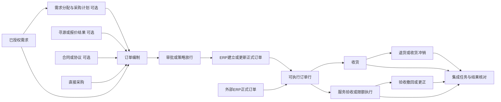

# 采购执行中心产品设计 V2 草案

日期：2026-09-24  
状态：设计评审稿，尚未实施。  
目标：作为企业采购执行产品的统一业务基线，支持合理默认流程、按企业配置及按场景扩展。  
依据：现有项目约束、用户已经确认的需求与计划扩展，以及 [整体评审和官方参考资料](PROCUREMENT_SYSTEM_REVIEW.md)。下文为基于这些材料形成的本项目设计建议，不代表任何厂商的统一强制规范。

## 1 产品定位与范围

产品解决的是：采购人员把已授权的采购需要转成明确的订单承诺，执行人员按订单记录真实交付，管理人员能够追踪差异和处理异常，ERP 接收一致且可追溯的业务事实。

产品主线仍为采购订单及订单行。需求与计划属于采购准备；合同和寻源属于可选商业依据；收货、服务验收、限额执行和反向处理属于履约；SAP 属于外部权威系统和集成边界。

“采购计划”在当前产品中定义为可执行的采购组织安排，回答采购哪些内容、由谁负责、何时采购、计划量与预估支出多少。年度预算、MRP 计算建议和执行采购计划属于不同对象，未来可关联，不能混成一个计划表。

### 1.1 能力分层

| 层次 | 能力 | 产品边界 |
| --- | --- | --- |
| 标准核心 | 订单及变更、统一履约、四类核心场景、反向处理、单据追溯、异常、基础审批与权限、集成任务 | 提供完整且可验证的业务闭环 |
| 采购准备模块 | 需求、需求池、汇总分配、采购计划、从来源编制订单 | 当前项目启用；允许其他企业关闭计划环节 |
| 可选业务模块 | 询比价与定标、合同执行台账、供应商协同、到货通知、质量检验、里程碑验收 | 可先接入外部业务结果，再扩展自有工作台 |
| 行业扩展 | 粮食扣量扣价、地磅、设备序列号、工程进度、特殊验收标准 | 通过专用策略和适配器接入，不能硬编码为所有采购规则 |
| 外部权威能力 | SAP 正式 PO、库存及会计凭证、供应商/物料主数据、预算系统、WMS/QMS | 接口同步、映射与状态反馈 |

不在基础版本内建设总账、应付核算、付款执行或完整 WMS。存在发票、库存移动等后续业务时，仍需接收其只读依赖状态，以判断订单变更和冲销能否进行。

产品化不等于立即实现多租户、计费和微服务。先形成可独立部署、可配置、可升级的标准产品；SaaS 隔离与商业计费属于明确有需求后启动的独立能力。

## 2 用户任务与角色

| 角色 | 主要任务 | 必须看清的信息 |
| --- | --- | --- |
| 需求人 | 描述需要、提交需求、补充资料、跟踪满足情况 | 为什么被退回、分配给哪个计划/订单、还有多少未安排 |
| 计划员/采购员 | 汇总、拆分、询价依据、选供应商、编制订单 | 来源差异、可分配余额、价格口径、交期偏差、待补资料 |
| 采购主管/审批人 | 判断授权、超估算或其他例外、审批变更 | 当前版本、原值与新值、原因、来源、影响和审批记录 |
| 收货/仓储人员 | 按订单接收货物，记录批次与数量 | 可收数量、处理中占用、检验要求、原单上下文 |
| 服务验收人 | 确认服务成果、工作量、期间与金额 | 本次验收依据、已验收和待审批金额、剩余额度 |
| 集成运维 | 核对未知状态、处理失败、恢复一致性 | 业务单号、请求身份、凭证、证据、允许的恢复动作 |
| 产品管理员 | 主数据映射、规则发布、角色权限和模块启用 | 生效范围、版本、影响预览、变更历史 |

同一用户可以兼任角色，但业务权限、审批分工和组织范围单独授权。不能因为有“查看订单”权限就能修改规则或审批自己的单据。自审批是否允许由明确审批策略决定，并保留审计。

首页以“我的任务”为入口，展示待补资料、待审批、待采购、待收货/验收及待处理异常。角色切换不改变底层单据含义。沿用现有统一履约工作台，不为每个场景复制主菜单。

## 3 业务路径与模块协作



图中的 ERP 放行节点对应当前项目默认的 SAP 正式订单权威模式。以后若启用平台权威模式，应有独立策略与实施验证，不通过临时跳过同步来模拟。

几个关系必须同时成立：

- 计划可以包含多个建议供应商；订单的实际签约供应商在订单头确定。
- 一个需求行可分配到多个计划或订单；一个计划行可分批形成多个订单行。
- 一个订单行可关联多个需求来源，同时依据合同或报价定价。
- 同一订单可以混合物料与服务，只要订单头的商业条件兼容。
- 来源、定价依据、采购策略、执行场景是不同维度，不能都塞入一个“订单类型”。

## 4 核心业务对象

| 对象 | 负责表达 | 不应承担 |
| --- | --- | --- |
| 需求单/需求行 | 谁需要什么、用途、规格、数量或金额需求、需要时间、建议供应商 | 已确定的交易价格或正式供应商承诺 |
| 计划/计划行 | 对采购需要的组织安排、负责人、采购方式、目标时间和估算基线 | 正式订单、实际支出或库存入库事实 |
| 来源分配记录 | 某个来源行向下游分配多少、占用/确认/释放状态 | 单纯字符串数组或手工累计字段 |
| 报价/定标/协议引用 | 供应商、价格条款、有效期、适用量与采用依据 | 强制所有业务经过完整寻源流程 |
| 订单/订单行/交付计划 | 确定的采购对象、数量或金额承诺、价格、交期、交付及验收要求 | 已经发生的收货/验收事实 |
| 业务归属分配 | 来源需求部门、项目、使用位置及分摊量/金额 | 要求普通人员维护会计科目 |
| 订单变更 | 原版本、拟修改值、原因、审批和生效结果 | 覆盖旧版本、重写已发生的执行历史 |
| 收货单/验收单/限额执行单 | 本次发生什么、什么时候发生、凭什么确认 | 只保存一个成功 Toast 或一个累计值 |
| 退货单/冲销单 | 对原业务的反向事实或更正关联 | 删除原正式记录 |
| 审批实例/审批任务 | 哪个版本由谁按什么策略批准、拒绝或撤回 | 与 SAP 请求状态合用一个状态字段 |
| 集成任务/调用尝试 | 对外执行什么、是否确认成功、尝试及核对证据 | 替代本地业务审批状态 |
| 规则版本/审计记录 | 规则何时生效、影响范围，谁改了什么 | 静默改变历史单据的解释 |

主键使用稳定 ID，业务单号用于显示，外部键保存系统标识、公司、年度等必要上下文。名称不是关联主键。供应商、组织、物料、单位、地点来自统一主数据目录或外部映射，保存单据时留名称快照。

原型允许建议供应商录入文本，但正式订单须解析为可交易供应商记录；临时供应商走受控新增/映射，不把任意文本自动当成 SAP 可用供应商。

## 5 数据归属与继承

### 5.1 默认权威边界

当前建议：本系统拥有需求、执行采购计划、采购编制稿、业务确认及说明；SAP 拥有正式 PO 版本、ERP 凭证、库存会计与财务结果。平台可发起订单建立和变更请求，但应在回写后更新正式版本。

每种单据、每个实施范围只确定一个正式权威来源。不能同时允许 SAP 和本系统无版本地修改同一个正式订单。

审批归属配置为平台、SAP 或明确编排的分阶段流程。分阶段流程必须说明各阶段审批的不同事项，不默认两边重复审批同一事项。SAP 同步成功不自动代表本地审批完成。

### 5.2 来源字段与订单字段

| 数据 | 计划带出方式 | 订单编制阶段 | 已生效后的处理 |
| --- | --- | --- | --- |
| 来源 ID、版本、原需求量和原估算 | 来源快照 | 不覆盖来源 | 历史保留 |
| 物料、规格、服务范围 | 默认继承 | 补充说明可编辑；替代对象/实质变更需规则及原因 | 变更版本 |
| 本次数量 | 默认剩余可分配量 | 可分批减少；超过余额不能静默通过 | 变更并重新校验来源占用 |
| 供应商 | 建议候选，不是绑定 | 选择任意合格供应商；有约束协议时校验适用性 | 原则上取消未执行部分并另建订单，不直接替换已有履约对方 |
| 单价 | 估算参考，必须标明来源 | 从有效协议/报价带入或人工确认，不默认为成交价 | 按价格变更策略处理 |
| 税与币种 | 能继承则带入 | 按商业条款确认；未知值不能伪装成零 | 重算并形成差异记录 |
| 需求日期 | 保存原始期望日期 | 单独填写承诺交期，比较早晚 | 保留变更原因与履约影响 |
| 交付地点/服务期间 | 默认继承 | 在授权范围调整 | 变更并通知执行方 |
| 部门/项目等归属 | 来源分配中保留 | 按权限维护，不丢失合并前明细 | ERP 已确定分配只读继承 |

没有规则禁止时允许业务调整；涉及采购目的、规格替代、授权量或正式条款改变时必须走相应校验。原始计划与需求不能因为下游改价、改交期而被悄悄覆盖。

## 6 数量 金额与计价模型

### 6.1 禁止用一个数值表示所有业务

分别表达：订购数量和单位、计价数量和单位、计价基数、单价、行金额、已收数量、验收金额、处理中占用、预计金额、最高限额。金额与数量分别校验。

| 场景 | 商业表达 | 履约控制 | 必要补充 |
| --- | --- | --- | --- |
| 库存/消耗性物料 | 数量 × 单价，可有计价基数 | 数量；需要时同时控制金额 | 工厂/地点、批次、序列号、库存管理属性 |
| 无物料号采购 | 描述、类别、数量、单位与价格 | 数量或约定金额 | 不强制物料号，仍需明确交付和验收要求 |
| 固定总价服务 | 合同服务金额，可附参考工作量 | 金额或验收里程碑 | 范围、期间、成果与验收标准 |
| 按量服务 | 小时/月/次等数量与单价 | 工作量及金额 | 商业单位保留，不把“月”改成“元”后丢失数量 |
| 限额服务 | 预计金额、最高限额、有效期 | 额度 | 本次实际服务内容、金额、依据；数量与单价可选 |

固定资产、外协、寄售、退货订单和其他扩展，须具备完整对象模型、动作和适配支持才能启用。无法识别的行进入“待识别”任务，不能默认按库存物料收货。

### 6.2 价格与税的口径

价格对象至少包含币种、含税/未税模式、计价单位、计价基数、价格来源及来源版本。产品首期可限定人民币，但模型不要将币种写死为单一字面值；未支持的币种应明确阻断。

建议统一存储未税金额、税额、含税金额及原始录入价格模式。用户可以按含税或未税方式录入。没有税率/税码依据时显示“待确认”，不自动套某个行业税率。

首期简单税制示例（不含折扣、费用、复合税，均为十进制金额计算）：

```text
计价数量 = 订购数量按已确认单位换算关系转换
未税行金额 = 计价数量 × 未税单价 ÷ 计价基数
税额 = 按本地化税规则与舍入策略计算
含税行金额 = 未税行金额 + 税额
订单合计 = 各行金额 + 明确列示的费用 - 明确列示的折扣
```

按件采购、按百件报价必须支持计价基数；单位换算须有来源与精度。不直接用 JavaScript 浮点累加定义财务金额。折扣和费用未实现时明确禁用，不接受后再忽略。

预算估算、报价、订单承诺、已验收与已开票金额属于不同指标。订单上限不是实际花费；限额服务的预计金额不是最高限额。订单摘要同时显示预计采购金额和最大承诺上限时要明确名称。

### 6.3 差异比较

价格偏差按“相同本次数量、币种、含税口径、计价单位”比较，避免少买一半被误报为节约一半。

例如计划 60,000 件、估算含税单价 8.50 元；本次采购 30,000 件、成交含税单价 8.20 元。则本次对应估算为 255,000 元，订单含税金额为 246,000 元，价格差异为 -9,000 元；剩余 30,000 件未采购。计划原总估算仍保留，不改成 246,000 元。

需求估价缺失应标记“未估价”，不能默认为零。明确免费项目必须记录免费原因。跨币种比较需要汇率、日期与折算口径；首期不支持时不生成伪比较值。

同一计量与币种下合并需求，估算总额应按各来源分配量及各自估价累加。可以展示加权参考单价，但不能用它覆盖原估价；缺失估价的来源须单独提示，不能纳入平均后隐藏。

计划整体进度优先使用已完成行数/总行数，或按冻结估算金额计算覆盖率并标注口径。不同单位数量不能直接相加。

## 7 分配 拆分 合并与占用

### 7.1 分配关系

需求到计划、计划到订单、需求直接到订单均使用逐行分配记录。记录来源行、下游行、分配数量及来源单位，或金额及币种、版本、状态与释放原因。计划到订单的来源分配不能再次把同一需求扣一遍。

关联多个需求时，订单行必须能够展开看到每条需求的分配量和业务归属。仅保留多个需求单号不能算完整追溯。

### 7.2 推荐占用时点

| 下游阶段 | 分配状态 | 对来源余额的影响 |
| --- | --- | --- |
| 编制/保存草稿 | 拟分配 PROPOSED | 不永久占用；显示当前可用量，提交时重新校验 |
| 提交审批 | 占用 RESERVED | 原子校验并占用，避免另一单重复使用 |
| 审批或策略放行 | 确认 COMMITTED | 计入已批准分配；ERP失败时保留，防止重复建单 |
| 审批驳回/撤回到草稿 | 释放后保留拟分配 | 释放审批占用，再提交重新争取余额 |
| 已批准单据取消/减量 | 部分或全部 RELEASED | 必须完成权威系统确认及下游依赖检查后释放 |

两类转换均采用该机制。计划取消时，只有没有下游占用/正式承诺的部分可以释放需求分配；已有订单必须先处理订单，不能直接把计划全部退回需求池。

```text
可分配量 = 已授权来源量 - 有效确认分配 - 有效审批占用 - 已关闭不再采购量
```

服务按量采购按商业数量分配，金额用于承诺与偏差控制；金额需求和限额需求按明确的金额维度分配。两种维度不能混算。金额变化不能通过篡改来源分配量来隐藏。

提交采用请求幂等键、单据版本和同一事务内的校验/占用。页面先查到余额不代表提交时余额仍有效。发生冲突应提示哪一行已被占用、当前剩余多少，并保留本次输入。

默认禁止超过已授权可分配量下单。包装整倍数、最小起订量等真实例外，应先增加有依据的授权量或形成带原因的额外采购授权，再参与校验；不能悄悄把超出量算回原需求，也不能通过修改单位规避限制。

### 7.3 合并规则

分三个层级处理：

1. 计划分组：可集中组织采购，但保留公司、规格、日期、归属等来源差异；集中工作包可以管理多公司，执行单据按法人拆分。
2. 订单头分组：默认同签约法人、采购组织、供应商及必要站点、币种、商业条款兼容。不同供应商应生成不同订单。
3. 订单行/交付计划分组：采购对象、规格、单位、计价依据、税处理和执行语义兼容；不同交期/交付地点通过交付计划表达，不能取第一条覆盖。

采购组、地点、税属性等按实际实施规则配置为订单头拆分条件或行/交付差异。不能简单规定所有不同地点都必须拆单，也不能无条件合并。

合并前展示结果预览：几张订单、各供应商、合并了哪些行、交付安排、金额和阻断原因。允许在规则范围内拆开；不允许人工强行合并不兼容的业务。

## 8 单据生命周期与审批

### 8.1 分离状态维度

| 维度 | 表达内容 | 例子 |
| --- | --- | --- |
| 单据生命周期 | 文档是否草稿、有效、关闭、取消 | 草稿/有效/关闭/取消 |
| 审批状态 | 当前版本是否获得授权 | 未提交/审批中/批准/驳回/策略免审 |
| 来源覆盖 | 来源被安排到哪里、还有多少未安排 | 未分配/部分分配/全部分配，另列处理中占用 |
| 订单发布/供应商确认 | 是否已传达承诺及得到确认 | 待发送/已发送/待确认/接受/拒绝，可按模块启用 |
| 履约状态 | 数量或金额完成情况 | 未执行/部分执行/完成；冻结、交货关闭独立标识 |
| ERP任务状态 | 某个具体请求的处理结果 | WAITING/PROCESSING/SUCCESS/FAILED/UNKNOWN |
| 风险提示 | 是否超期、超估算、资料待补 | 由事实计算，不能覆盖“部分执行”等状态 |

“未提交”不能用“免审批”代替；“已全部转订单”不能代替“需求已满足”；“超期”可以与“部分执行”同时存在。

### 8.2 默认流程

- 需求：草稿 → 提交 → 审批/策略授权 → 可分配；支持驳回、撤回、关闭未满足余额。
- 计划：编制 → 提交 → 审批/策略授权 → 执行；计划调整保留版本及来源分配变化。
- 订单：草稿 → 提交 → 审批/策略授权 → ERP建立/更新 → 按发布策略成为可执行订单。
- 服务验收：草稿 → 提交 → 业务验收/审批 → 生效 → ERP处理；验收不通过不计入已验收金额。
- 收货：草稿 → 确认事实 → 生效/占用 → ERP处理；是否需要单独业务审批可配置。

草稿可缺少最终必填信息，但禁止非法类型和明显无效值。提交才执行完整业务校验。自动批准必须由可追溯策略产生，不能因为从计划生成就直接赋 APPROVED。

审批至少记录当前处理人、意见、时间、命中策略和单据版本。后续支持条件审批、代理与催办；首期使用简单审批链或明确免审策略即可，不要求实现通用 BPMN 平台。

### 8.3 可执行资格

由统一业务服务返回操作能力及禁用原因，各页面共用：当前正式版本可执行、审批满足、未取消/冻结/关闭、场景支持、用户有权限、有剩余额度、必要 ERP 标识已就绪，且不存在阻断当前动作的处理中任务。

某次收货请求失败不等于订单本身不存在；某次服务请求 UNKNOWN 也不应让所有无关订单停用。任务按具体业务对象、动作和版本隔离，相关余额仍需占用。

## 9 订单编制与变更体验

### 9.1 所有入口复用订单编制

直接新建、需求转单、计划转单、协议调用和寻源结果转单，共用订单领域校验与编辑器。入口只负责提供默认值、来源引用和编辑权限。

计划转单使用独立业务页面，推荐三个步骤：选择来源与本次数量 → 完善商业和交付条件 → 核对差异并保存/提交。步骤可在同页切换，不强制所有业务多点几次。

| 区域 | 关键内容 |
| --- | --- |
| 固定上下文 | 当前来源、采购员、选中行数、拟生成订单数、当前草稿状态 |
| 订单头 | 实际供应商、公司、采购组织/组、币种、日期、付款/交付条款及联系人，条件从主数据带出 |
| 来源与数量 | 计划量、已批准转单、处理中占用、当前可用、本次数量、转后剩余 |
| 行商业信息 | 内容/规格、单位、估算参考、价格来源、本次单价、计价基数、税、未税金额、税额与含税金额 |
| 交付或服务 | 原需求日期、承诺交期、分批安排、地点；服务期间/成果/验收方式；限额预计值及上限 |
| 差异与校验 | 缺失项、超余额、改价、延期、供应商选择、协议偏离；可定位到具体行 |
| 汇总与操作 | 当前订单合计、对应来源估算、差异，保存草稿、提交审批，取消返回 |

说明：不是每个字段都永远手填必填。提交必备项由场景和企业策略决定，已可靠继承的字段展示确认即可。付款条件不能总是缺失，也不能要求无需该条款的业务人为填假值。

把错误分为阻断、需审批例外和提示。阻断必须修正；例外提交原因及依据；提示不强制重复确认。选了多少行、实际创建几张单、哪些失败必须有结果清单。

供应商候选只提供推荐与来源说明；无推荐不影响正常选商。存在合同锁定或定标限制时，显示真正的限制来源与允许的偏离流程，不能把建议供应商误当限制。

### 9.2 正式订单变更

已生效订单保留版本，创建变更草案，逐项显示前后值、原因和对金额、交期、来源占用、已执行部分的影响。审批通过及权威系统确认后才切换正式版本。

已收数量、已验收事实和原凭证不能被新版本重写。价格调整如何影响尚未执行部分、已验收待开票部分，由业务策略和 ERP 能力决定；首期可以限定只调整未执行部分。

减少未交数量、取消未执行余额和标记交货完成分别记录。关闭不等于足量交付：订单 100 吨收到 98 吨后关闭 2 吨，仍显示实际收到 98 吨及关闭原因。

## 10 履约 退货与冲销

### 10.1 履约账与业务状态

执行单据保存完整头、行、附件、审批和原始输入。正式生效时产生不可直接覆盖的业务事件；列表中的累计值由事实及占用汇总，可缓存但能核对来源。

```text
净收货数量 = 生效收货 - 生效收货冲销 - 生效采购退货 + 生效退货冲销
可新收数量 = 允许收货上限 - 净收货数量 - 尚未计入净额的有效收货占用 - 不再交付量
可新验收金额 = 合同可验收金额或额度 - 净生效验收金额 - 尚未生效的有效验收占用
```

同一业务不能既计入净额又计入占用，避免双重扣减。反向操作处理中先不增加可执行余额。SAP失败不抹掉实际到货事实；业务确认状态与 ERP过账状态并列，异常关闭和占用释放由明确动作处理。

上述公式按同一单位、同一范围计算；取消或交货关闭的行，可新执行量直接为零，不能因超收容差仍出现可收余额。计算为负数时应揭示账务/占用差异并阻止新执行，不能简单截断为零掩盖不一致。原收货标记为“已冲销”后，采用原始正向事件加反向事件计算净额，不能既移除原正向量又减一次冲销量。

超过订单量的收货，仅在有效超收政策范围内可执行；没有政策默认不允许。容差取自 SAP PO、已批准例外、组织/场景策略，并检查规则冲突。不能仅靠输入框 max 控制。

### 10.2 收货与质量

普通业务保留快速收货 Drawer；多批次、多订单行或检验业务使用完整单据页。必须显示本次影响、处理中数量及已记录的交付。

到货、待检、业务接收、ERP过账可以是不同阶段；质量模块未启用时采用明确的简化收货流程。单位换算、批次和序列号校验需与订单行上下文一致。无物料号不强制填物料，但必须有可识别描述和采购类别。

### 10.3 服务与限额

服务验收关联服务期间、内容/成果、工作量或里程碑、验收标准、金额、验收人和附件。拒绝与有条件通过必须定义是否产生承诺/验收金额，不能都走同一个“提交成功”结果。

限额服务保留预计金额、总限额、累计生效、审批中占用和余额。超过预计金额可以按策略预警；超过上限不能通过普通确认按钮绕过，应先批准额度变更。计量基准与原订单一致，不能含税上限和未税验收混算。

SAP服务处理可能生成后续收货凭证，业务前台仍称“服务验收”；适配器负责实际接口及凭证链，不让业务人员以库存收货代替服务确认。

### 10.4 反向业务

| 动作 | 适用情形 | 核心校验与后果 |
| --- | --- | --- |
| 采购退货 | 原收货正确，后来真实退供应商 | 关联原收货行/批次；扣除已退、已冲销和处理中占用；检查库存及后续依赖 |
| 收货冲销 | 原收货事实录入错误 | 检查原单是否有效及可反向，保留原单并新增反向记录 |
| 退货冲销 | 原退货录入错误 | 关联原退货，不超可冲销量；重新计算净执行 |
| 服务验收撤回/更正 | 验收结果或金额错误 | 按审批、ERP及发票依赖决定撤回还是反向更正，不套库存退货 |

“需要补货”决定后续交付义务是否恢复。无需补货时通过剩余关闭/订单变更处理，不能仅减净收货就自动催补全部退货量。冲销不直接释放计划采购量：订单承诺仍然存在，只有订单的减量/取消才影响上游分配。

高风险动作显示影响对象、数量/金额、原因和二次确认。正式历史不可删除。下游已开票/已耗用等是否可反向，须由权威系统提供事实和可用动作，不凭前端推测。

## 11 单据流与业务可解释性

单据流与操作历史是两个视图：前者显示需求、计划、订单、交付、验收、退货/冲销、ERP凭证之间的关系；后者显示人员、动作、版本和时间。

节点支持查看详情；边显示关联类型、分配量/金额与来源版本。聚合后仍可下钻到原需求行及业务归属。单据显示以下信息：从哪里来、当前版本、为何变化、谁批准、影响哪里、接下来谁处理。

订单列表和详情同时显示单据/审批状态与履约进度，SAP状态作为独立辅助信息。新订单无 SAP 号时使用业务单号，不能出现空白主键列。

## 12 主数据 审批权限与集成

### 12.1 主数据

供应商、法人、采购组织、采购组、物料/服务类别、单位、工厂、交付地点和业务归属有统一目录及有效状态。选择器按组织关系过滤。

业务编号与 SAP 映射分开。建议供应商可以是推荐文本；订单实际供应商须有效且已满足当前发布通道的主数据要求。修改上游主数据不覆盖历史快照。

### 12.2 权限与审计

菜单可见、路由访问、业务动作、字段敏感性和组织数据范围分别控制。价格是否对仓储人员可见可配置。后端/Mock业务服务也执行动作和状态校验，不能只隐藏按钮。

审计记录实际操作者、代理身份、时间、变更前后值、原因、单据版本和请求ID。技术报文权限与业务查看权限分开。首期提供需求人、采购员、收货员、服务验收人、审批人、运维和管理员角色模板。

### 12.3 集成任务

业务动作通过中立命令进入集成任务，由 SAP Adapter 映射。外部状态转换保留原始码与规范状态，业务模型不绑定某个 BAPI 或一个 SAP 版本。

业务请求 ID 作为稳定幂等身份，调用尝试另有 ID。重试沿用业务身份，先判断原动作是否已经执行；不能为同一业务重试生成一个新的独立过账身份。

UNKNOWN 保留相关占用，先核对原请求、ERP凭证和业务对象。核对结果可以是已成功、明确未执行、仍未知或不一致，不能总返回成功。

对账从双方事实得出差异，形成带责任人、建议、处理记录和复核结果的任务。“已处理”必须有修复或接受差异的证据；接受差异不等于改写为数据一致。

SAP延迟、失败与业务成功分开表达。页面提供“单据已保存，ERP处理中”等真实结果，并支持后续查询。规则或适配能力不支持时明确列为未支持，不能用成功提示掩盖。

## 13 配置与扩展机制

### 13.1 三类变化

| 类型 | 处理方式 | 示例 |
| --- | --- | --- |
| 产品不可绕过约束 | 领域层/业务服务统一维护 | 金额不能与数量相加；正式历史保留；UNKNOWN不可直接重试；同一来源不能重复占用 |
| 企业策略 | 类型化配置、范围、版本与生效时间 | 是否必须计划、审批路径、价格差异处理、收货容差、发布前置条件 |
| 专业场景扩展 | 明确扩展契约与专用实现 | 粮食质价计算、外协供料、设备序列号、工程里程碑、外部ERP适配 |

采购对象类型、计价方式、库存管理方式和执行控制方式分别建模，避免每一种组合都新增完整页面。标准场景是预置组合，而不是不可变化的客户专属编码。

### 13.2 配置中心职责

- 执行场景：回答订单行适用什么执行语义、控制方式、允许哪些动作。
- 场景识别：按标准上下文匹配；有优先级、冲突检测和无法识别结果。
- 动态字段：回答某个动作中字段如何显示、默认、只读、必填和校验。
- 业务策略：管理超量/差异/审批/关闭等规则，不能藏在字段提示文字中。
- 外部映射：管理组织、主数据、动作及接口映射，面向实施/运维。

“添加一个字段”不能替代“实现一种业务能力”。扩展字段必须有数据类型、存储、校验、权限、检索和必要映射；核心数量、金额、上限及原单关系不能随意删改。

### 13.3 规则生效流程

规则草稿 → 用代表性订单预览匹配与表单 → 冲突/兼容性校验 → 发布版本 → 按生效范围使用。支持回退到新发布的旧配置内容，并保留历史。

每类策略明确自己的优先级，不用一个全局顺序解释所有规则。相同优先级冲突应阻止发布；没有匹配项时使用明确默认或要求处理，不能默认普通收货。

单据记录采用的规则版本。历史单据按当时版本解释；未提交草稿遇到新规则可提示重校验。提交时仍需检查最新的有效余额、主数据禁用和外部约束，不因规则快照而绕过当前限制。

规则评估输出统一的表单 Schema、业务校验结果和动作能力。配置页与实际页面必须读取同一来源；文本说明不是可执行规则。首期使用受限条件和类型化策略，不开发任意脚本执行或全能低代码引擎。

## 14 页面体系与产品体验

建议导航：我的工作；采购准备（需求、汇总、计划）；采购订单；采购履约；退货与更正；集成与异常；管理配置。寻源/合同等菜单按能力启用，不展示看似可用但只有占位提示的模块。

沿用 enterprise-ui、procurement-ui、dynamic-form、enterprise-table、sap-integration-ui、visual-quality 的企业后台规范：列表以任务筛选和表格为主；详情展示状态、摘要和明细；复杂订单编制使用独立页面；简单执行使用 Drawer。

| 页面族 | 必须支持的产品体验 |
| --- | --- |
| 列表与工作台 | 角色相关状态、保存筛选、待处理原因、明确下一步、空/错/无权限状态 |
| 单据详情 | 来源、商业内容、业务状态、履约、变更审批、单据关系及ERP信息 |
| 编制/变更页 | 自动带出但可解释；只读与可编辑区分；金额即时重算；就地错误和汇总校验 |
| 执行与反向页 | 原单上下文、可用余额、业务影响、原因、处理中状态与真实结果 |
| 配置页 | 适用范围、生效版本、预览、影响说明和发布权限 |

1440宽度下采购内容、数量、成交金额应容易定位，不把最关键列藏在窄抽屉横向滚动之外。金额列右对齐并带币种，数量带单位。差异有文字、图标和数值，不能只靠颜色。

保存草稿后可恢复；离开未保存内容时提供明确处理。错误后保留输入，跳转可返回来源页。上传需要真正的附件记录与下载能力；原型未提供跨用户存储时清楚说明演示范围。

## 15 系统架构与产品交付

保留 React、TypeScript、Ant Design、Router、Query、Zustand、MSW 技术栈和当前模块化结构。建议先演进为边界清晰的模块化应用，不为产品化提前拆微服务。

职责划分：

- `domain`：计量金额、来源分配、单据状态、场景策略、执行资格、业务校验；不依赖 React。
- `features`：按用户任务组织页面、表单与交互；不各自重新定义价格和余额公式。
- 业务应用服务/API：执行命令、权限与状态校验、版本冲突、占用、审计和跨模块事务。
- 查询模型：服务列表、统计及追溯；累计值与正式单据关联，避免不同数组成为不同真相。
- `shared`：统一编辑布局、状态标签、数量金额、错误摘要、附件和单据引用组件。
- `mocks`：实现与真实服务一致的命令合同和状态迁移，不在页面里编造结果。

原型交付先提供一致的浏览器内数据仓库、版本化种子数据、显式重置、可选择的成功/失败/未知场景。浏览器本地持久化只解决同一浏览器的演示连续性，不能声称同事共享了真实业务数据；多人协作需后端服务。

产品交付包应包含：能力启用清单、角色模板、默认策略、组织与主数据映射说明、场景样例、升级迁移说明、已知限制及验收脚本。样例时间使用统一演示基准或可控相对日期，避免全部自然过期。

现有数据迁移应逐项处理来源差异：计划生成的服务行按原商业数量、价格与来源核对，直接订单按已有金额和可证明的计量信息恢复，不能把所有 `orderedValue` 按同一个公式转换。缺单价、缺单位或缺来源分配的旧记录进入待核对清单，不编造历史。迁移后订单总额、行金额、来源占用和执行余额分别校验，再切换查询入口。

版本升级保护已发布规则、单据快照及扩展字段。新增场景的接入契约至少包含领域数据、匹配条件、表单、校验、动作、反向处理、权限、集成映射和验收场景；缺任一关键项不能只靠枚举启用。

## 16 分期与验收

### 16.1 版本建议

| 版本阶段 | 包含 | 暂不纳入 |
| --- | --- | --- |
| 可交付核心原型 | 数据口径/分配/状态，需求到计划到订单，统一编制与基本变更，四类履约，退货冲销，审批与ERP闭环模拟，规则实际生效 | 完整寻源平台、合同法务、供应商门户、财务核算 |
| 标准产品增强 | 主数据接口、组织角色、可配置审批、交付计划、对账任务、受控规则发布、来源协议接入 | 未验证适配的行业特殊采购 |
| 业务扩展包 | 里程碑、质量/仓储对接、供应商协同、行业策略、多币种及本地化 | 无需求驱动的万能流程/低代码平台 |

这是范围分层，不能在核心业务仍只弹成功提示时，以继续增加扩展菜单代替闭环。

### 16.2 跨模块验收故事

| 编号 | 场景 | 应得到的结果 |
| --- | --- | --- |
| A01 | 需求 1000吨，先计划 600吨，再计划 400吨 | 来源分配可查，不能重复计划超过1000吨 |
| A02 | 同物料两条需求价格/交期不同 | 展示各来源，估算按原始来源金额保留；不能用首行价覆盖全部 |
| A03 | 包装袋60000件先采购30000件，改价8.50→8.20 | 本次金额246000元、对应估算255000元、剩余30000件，原计划不被覆盖 |
| A04 | 一条计划向两家供应商分批采购 | 两张订单，分配总量准确；无建议供应商也可正常创建 |
| A05 | 12个月服务与固定总价服务分别生成订单 | 期间、商业数量和金额不丢失；不能把12个月变成12元可验收 |
| A06 | 限额预计10万，上限15万，已确认6.35万，另有2万待审批 | 生效、占用、余额分别展示，可新增不超过6.65万；超过预计值与超过上限结果不同 |
| A07 | 两人同时对同一计划剩余量提交订单 | 仅合法分配成功，另一人获得可定位的余额冲突；不重复扣减 |
| A08 | 订单草稿/待审批/ERP建立失败时尝试收货 | 各入口遵守同一资格规则，并说明原因 |
| A09 | 提交收货，刷新订单/工作台/记录 | 同一业务事实一致可见；重复请求只形成一张业务单 |
| A10 | 原收货250吨，已退50吨，待处理退货20吨 | 当前可新增退货最多180吨，再受库存/后续依赖限制 |
| A11 | 已冲销收货再次冲销或退货 | 阻止重复反向；原记录及反向记录仍可追溯 |
| A12 | 验收不通过、撤回，或存在后续发票的验收更正 | 不错误累计通过金额；按依赖限制恢复，不直接删原单 |
| A13 | 收货98吨后关闭100吨订单剩余2吨 | 展示98吨实际交付和2吨关闭，不伪装为已收100吨 |
| A14 | SAP超时但实际已有凭证 | 核对后关联原凭证；不重复过账；处理中占用正确转为结果 |
| A15 | 改字段/容差规则并发布 | 新版本在实际表单和业务校验生效，历史单据仍可解释 |
| A16 | 不同公司、不同单位、不同规格汇总 | 禁止不兼容合并；跨单位不做无意义数量总和 |
| A17 | 已生效订单减量或改交期 | 对比版本与下游影响，审批/ERP确认前不覆盖正式内容 |
| A18 | 普通收货员访问审批、配置、技术报文 | 按权限和数据范围控制；只隐藏按钮不能代替服务校验 |
| A19 | 计划下订单引用合同并依据定标价格 | 需求、计划、合同、报价可同时追溯，不能只剩一个来源类型 |
| A20 | 取消订单未交余额，或退货选择不补货 | 前者受控释放相应来源占用；后者不自动释放计划采购量或重复催补 |

这些是后续验收条件，本轮未执行。已有少量计算和字段测试不足以证明整条业务成立。

### 16.3 产品指标

先统一数据口径，再提供需求到下单周期、审批等待时长、按期交付率、订单价格相对冻结估算差异、验收异常率、ERP一次成功率和异常处理时长。每个指标注明时间窗、分母、金额口径及排除项，提供明细下钻。

“节约金额”仅在同口径、同范围比较成立时使用；采购少了不能直接当节约，关闭未交量不能当供应商按期完成。

## 17 建议定稿的设计决策

| 决策 | 建议默认 | 可扩展边界 |
| --- | --- | --- |
| 产品主线 | 订单行驱动，需求与计划为可启用模块 | 支持外部来源及无计划订单，不强制完整长链路 |
| 当前正式订单权威 | SAP；本地编制与变更请求保留快照 | 平台权威模式作为明确实施选项，不混用 |
| 计划含义 | 执行采购计划 | 年度预算/MRP建议另建对象与引用 |
| 数量金额 | 物理数量、商业数量、金额、预计值、上限分别表达 | 计价、单位换算、里程碑策略可扩展 |
| 分配与占用 | 草稿拟分配、提交占用、批准确认、受控释放 | 特殊长期草稿锁定必须有明确时限和释放机制 |
| 订单生成 | 形成可审查草稿，补齐商务条件后提交 | 可靠主数据与价格策略可支持受控自动转单 |
| 建议供应商 | 可空、可不采用 | 合同/定标约束另行校验，不能冒用推荐字段 |
| 审批 | 按策略决定人工或免审；实例绑定版本 | 接入客户现有流程，避免强制重复审批 |
| 配置 | 业务策略与字段规则分开，发布后真实生效 | 专业能力通过扩展接口实现，不任意脚本化 |

上述涉及核心模型变化，应作为一组连贯决策评审，而不是只批准某个页面增加几个字段。定稿后再更新正式业务设计文档与前端架构，并按整体评审中的 D1–D5 顺序实施。
